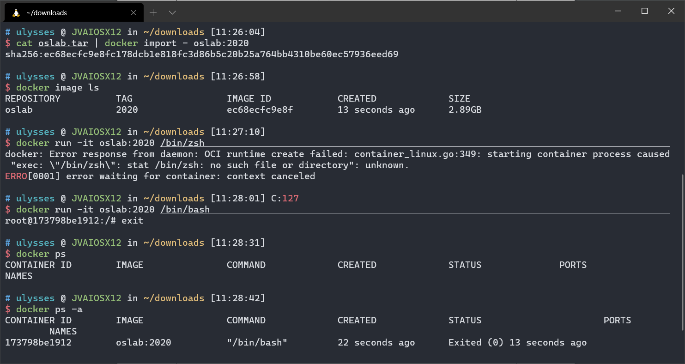
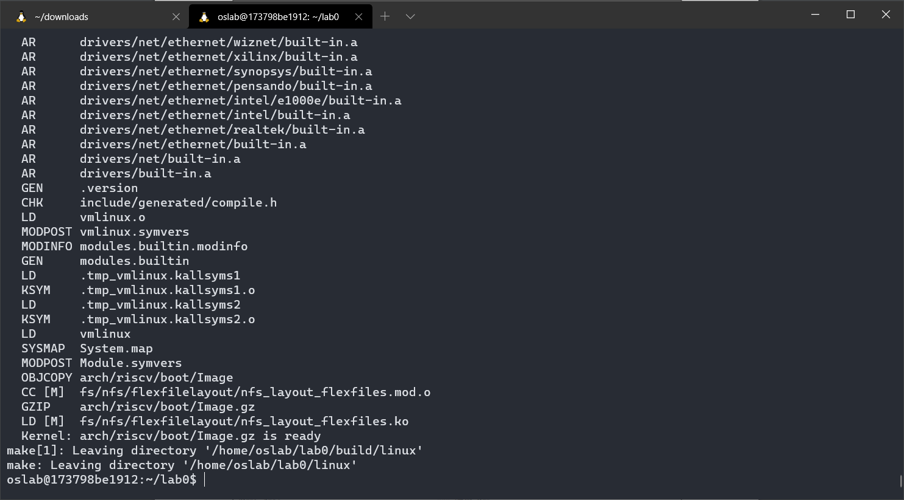
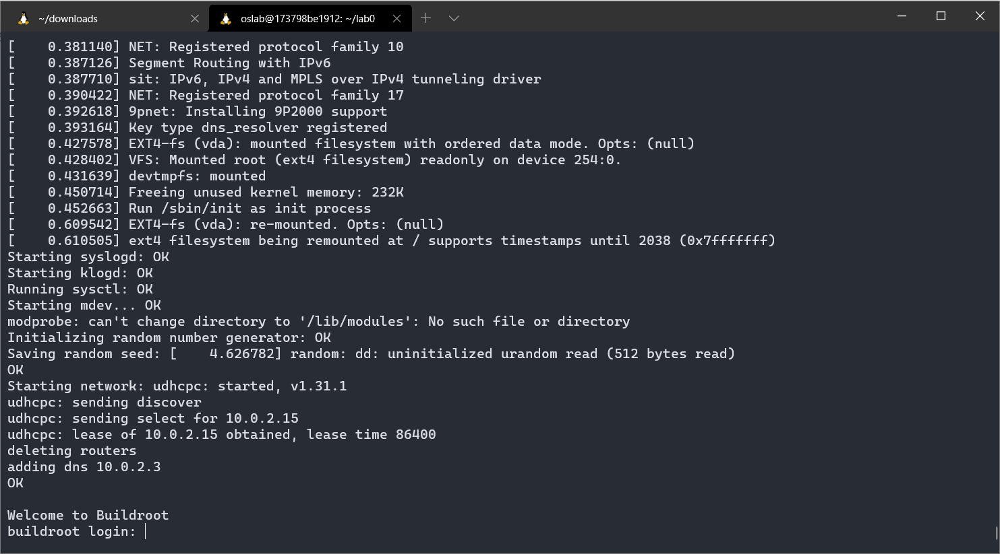
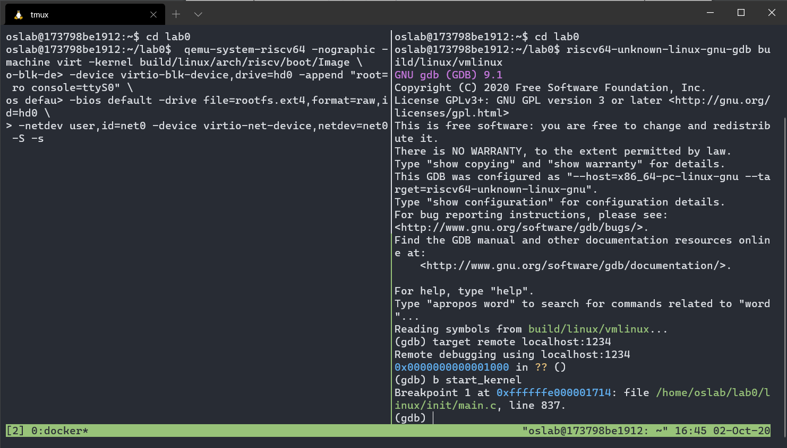
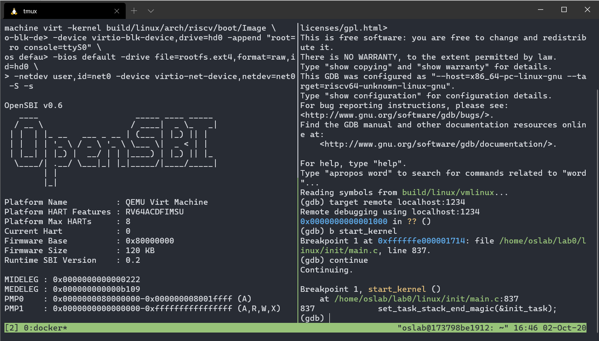
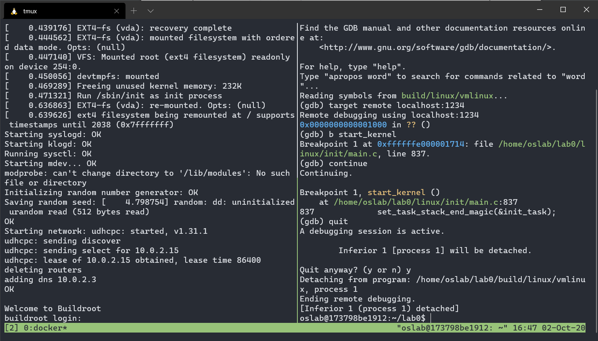
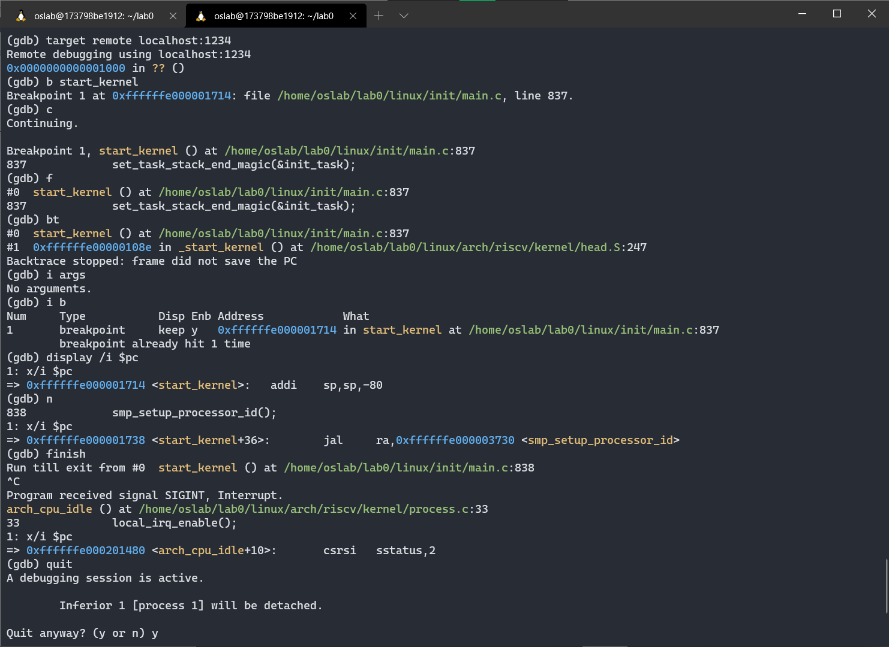

<center><font size=7>《操作系统》Lab0</font></center><br /><div align='right'><font size=4><b>陈希尧</b> 3180103012</font></div>

[TOC]

# Lab Basis

## Purpose

* 编译内核并用 gdb + QEMU 调试，在内核初始化过程中（用户登录之前）设置断点，对内核的启 动过程进行跟踪，并尝试使用gdb的各项命令（如backtrace、nish、frame、info、break、 display、next等）。
* 在学在浙大中提交pdf格式的实验报告，记录实验过程并截图（4.1 - 4.4），对每一步的命令以及结 果进行必要的解释，记录遇到的问题和心得体会。

## Environment

OS: Ubuntu 18.04.5 LTS on Windows 10 x86_64 (WSL2)

Kernel: 4.19.128-microsoft-standard

Docker version 19.03.13

# Lab Steps

## Docker Installation

> Reference: https://docs.docker.com/engine/install/ubuntu/#install-from-a-package

1. Get link address of docker-ce, docker-ce-cli and container.io using `wget`

    ```
    https://download.docker.com/linux/ubuntu/dists/bionic/pool/stable/amd64/containerd.io_1.3.7-1_amd64.deb
    https://download.docker.com/linux/ubuntu/dists/bionic/pool/stable/amd64/docker-ce-cli_19.03.13~3-0~ubuntu-bionic_amd64.deb
    https://download.docker.com/linux/ubuntu/dists/bionic/pool/stable/amd64/docker-ce_19.03.13~3-0~ubuntu-bionic_amd64.de
    ```

2. `sudo dpkg -i ${pathToPkg}` to install 

3. `sudo service docker start` (important, seems the daemon won't start automatically)

4. add user to docker group, which is sudoers

    ```zsh
    sudo usermod -aGdocker ulysses
    sudo chmod a+rw ~/.docker/config.json
    sudo chmod a+rw /var/run/docker.sock
    ```

5. Try running hello-world

## Create Container

1. Use `cat` and pipline to import image
2. `docker image ls` to check if image is imported correctly
3. Start container from image using `docker run -it osab:2020 /bin/bash`
    * No zsh installed
    * `-i`: interactivate
    * `-t`: terminal
4. `^D` to exit the container
5. `docker ps` can show all the container on the run
    * Same usage as `ps`
    * `-a` to show all container that has been started
6. `docker start 1737` can restart stopped container
7. Now the status can be seen using `docker ps`
8. `docker exec -it -u oslab -w /home/oslab 17 /bin/bash` to enter the container

Screenshots:




## Compile kernel

First set the system variables(I add them to "~/.bashrc" for convenience), then just `make` following the instructions.


```bash
oslab@173798be1912:~$ ls
lab0
oslab@173798be1912:~$ cd lab0
oslab@173798be1912:~/lab0$ export TOP=`pwd`
oslab@173798be1912:~/lab0$ export RISCV=/opt/riscv
oslab@173798be1912:~/lab0$ export PATH=$PATH:$RISCV/bin
oslab@173798be1912:~/lab0$ mkdir -p build/linux
oslab@173798be1912:~/lab0$ make -C linux O=$TOP/build/linux \
> CROSS_COMPILE=riscv64-unknown-linux-gnu- \
> ARCH=riscv CONFIG_DEBUG_INFO=y \
> defconfig all -j$(nproc)
```

Screenshot:


Compile done:



## Run kernel

```bash
oslab@173798be1912:~/lab0$ qemu-system-riscv64 -nographic -machine virt -kernel build/linux/arch/riscv/boot/Image \
> -device virtio-blk-device,drive=hd0 -append "root=/dev/vda ro console=ttyS0" \
> -bios default -drive file=rootfs.ext4,format=raw,id=hd0 \
> -netdev user,id=net0 -device virtio-net-device,netdev=net0
```

Screenshot:



## Debug kernel

Use tmux to split the screen

First start the `qemu-system-riscv64` program, here 

* `-s`: shorthand for -gdb tcp::1234
* `-S`: freeze CPU at startup (use 'c' to start execution)

Before `continue`, since stop-on-entry(`-S`) is set, the program will stop at enrty will no output: 



After `continue`, the program will continue to run to the breakpoint, which is at flag `start_kernel`:



After `quit` gdb, the `qemu-system-riscv64` will continue to execute normally, so it will skip to the login interface:



Then Try more gdb command:

```bash
(gdb) target remote localhost:1234
(gdb) b start_kernel	# break
(gdb) c		# continue
(gdb) f		# frame, Select and print a stack frame.
(gdb) bt	# backtrace, Print backtrace of all stack frames, or innermost COUNT frames.
(gdb) i args
(gdb) i b
(gdb) display /i $pc
(gdb) n			# next, step over
(gdb) finish	# Upon return, the value returned is printed and put in the value history.
```



# Problems & Thoughts

## Problems

1. 网络问题，本来打算通过apt安装docker的，后来发现换源这步挂了梯子都无法连接到[download.docker.com](https://download.docker.com)，遂放弃，改用包安装
2. 根据官方手册，下载.deb包并安装完后守护进程会自动启动，因此提示说"docker: Cannot connect to the Docker daemon at unix:///var/run/docker.sock. Is the docker daemon running?."的时候我以为是socket连接的问题，后来才发现是daemon根本没开始，`sudo service docker start`后解决
3. `qemu-system-riscv64`开始后，"^c"只能退出到qemu的登陆界面，不知道怎么退出，一直通过`ps`+`kill`解决

## Thoughts

本次实验主要完成了docker环境的配置与qemu平台的初步试验，难度较低，我的主要收获是掌握了gdb中一些基础的命令，由于之前一直是用ide的工具链或是vscode的插件进行调试，对gdb的指令接触较少，相信学习这些对我以后的实验很有帮助。

