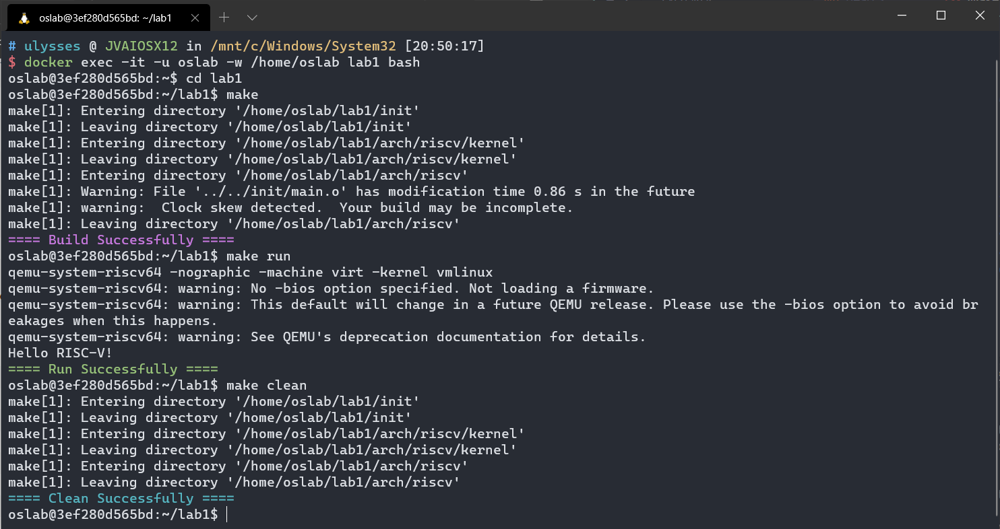
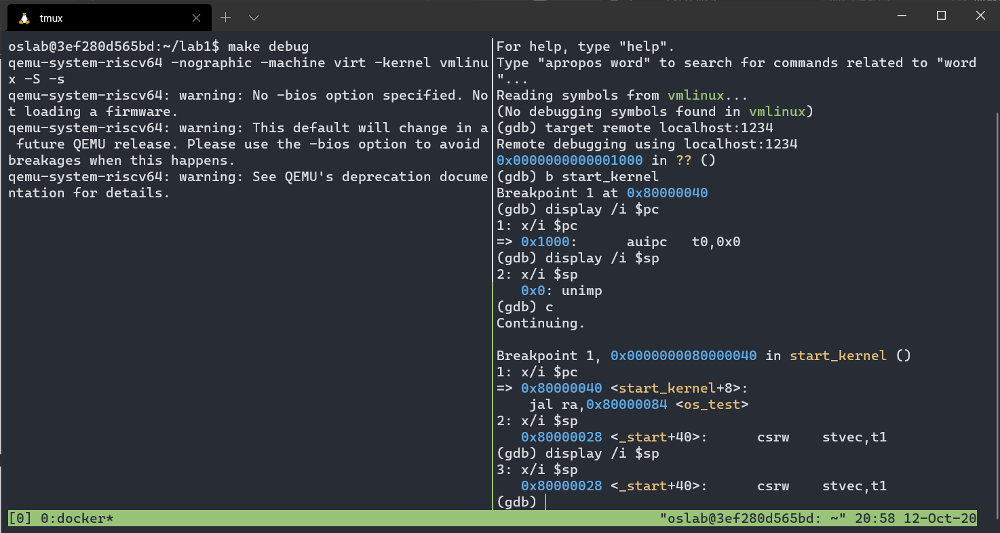

<center><font size=7>《操作系统》Lab1</font></center><br /><div align='right'><font size=4><b>陈希尧</b> 3180103012</font></div>

[TOC]

# Lab Basis

## Purpose

学习RISC-V相关知识，Makele相关知识，编写head.S实现bootloader的功能，并利用Makele来完成对整个工程的管理。

## Environment

OS: Ubuntu 18.04.5 LTS on Windows 10 x86_64 (WSL2)

Kernel: 4.19.128-microsoft-standard

Docker version 19.03.13

## Lab Principle

### Kernel

#### vmlinux

vmlinux通常指Linux Kernel编译出的可执行文件（Executable and Linkable Format，ELF），特点是未压缩的，带调试信息和符号表的。在本实验中，vmlinux通常指将你的代码进行编译，链接后生成的可供QEMU运行的RISC-V 64-bit架构程序。

内核在加载用户态文件的时候要先解析elf文件，但是bootloader得自己setup，所以需要vmlinux.lds

#### System.map

System.map是内核符号表（Kernel Symbol Table）文件，是存储了所有内核符号及其地址的一个列 表。“符号”通常指的是函数名，全局变量名等等。使用`nm vmlinux`命令即可打印vmlinux的符号表，符号 表的样例如下：

#### Mode

| M 11  | S 01   | U 00 |
| ----- | ------ | ---- |
| (VMM) | Kernel |      |

#### Driver

——Memory Mapped IO，能将外设的串口映射到物理地址上

本部分主要是介绍QEMU模拟的 RISC-V Virt 计算机访问外设的方法。简要的说，RISC-V使用 MMIO（Memory Mapped I/O）技术，将外设映射到各个物理地址，这样我们可以通过访问物理地址来 操作外设。在virt.c的virt_memmap[]中有各个外设的物理地址。本次实验只需要关注0x10000000地址 即VIRT_UART0，它是串口，通过向串口写入字符我们可以将它们打印出来。 在test.c中有一个putChar函数使用了串口，打印所需的字符串。这只是一个最简单的版本，最终我 们可以利用这个串口实现printf函数。

#### CSRs

##### mstatus

特权寄存器，仅在M下可访问，mie at bit 3, mpie at bit 7

查看模式：

切换模式：

##### mie & mip

The mip register is an MXLEN-bit read/write register containing information on pending interrupts, while mie is the corresponding MXLEN-bit read/write register containing interrupt enable bits. Interrupt cause number i (as reported in CSR mcause, Section 3.1.16) corresponds with bit i in both mip and mie. Bits 15:0 are allocated to standard interrupt causes only, while bits 16 and above are available for platform or custom use.


##### mtvec

| base[mxlen-1:0] | mode[1:0]                                                    |
| --------------- | ------------------------------------------------------------ |
|                 | 0: direct, all exceptions set to base<br />1: vectored, Asynchronous interrupts set pc to BASE+4×cause. |

### RISC-V Instruction

* csrw csr, rs1
    * CSRs[csr] = x[rs1]
    * 写控制状态寄存器 (Control and Status Register Set). 伪指令(Pesudoinstruction), RV32I and RV64I.
    * 对于 x[rs1]中每一个为 1 的位，把控制状态寄存器 csr 的的对应位置位，等同于 csrrs x0, csr, rs1.
* csrrw rd, csr, rs1
    * t = CSRs[csr]; CSRs[csr] = x[rs1]; x[rd] = t
    * 读后写控制状态寄存器 (Control and Status Register Read and Write). I-type, RV32I and RV64I.
    * 记控制状态寄存器 csr 中的值为 t。把寄存器 x[rs1]的值写入 csr，再把 t 写入 x[rd]。
* csrc csr, rs1
    * CSRs[csr] &= ~x[rs1]
    * 清除控制状态寄存器 (Control and Status Register Clear). 伪指令(Pesudoinstruction), RV32I and RV64I.
    * 对于 x[rs1]中每一个为 1 的位，把控制状态寄存器 csr 的的对应位清零，等同于 csrrc x0, csr, rs1.
* csrrc rd, csr, rs1
    * t = CSRs[csr]; CSRs[csr] = t &~x[rs1]; x[rd] = t
    * 读后清除控制状态寄存器 (Control and Status Register Read and Clear). I-type, RV32I and RV64I.
    * 记控制状态寄存器 csr 中的值为 t。把 t 和寄存器 x[rs1]按位与的结果写入 csr，再把 t 写入 x[rd]。
* csrs csr, rs1
    * CSRs[csr] |= x[rs1]
    * 置位控制状态寄存器 (Control and Status Register Set). 伪指令(Pesudoinstruction), RV32I and RV64I.
    * 对于 x[rs1]中每一个为 1 的位，把控制状态寄存器 csr 的的对应位置位，等同于 csrrs x0, csr, rs1.
* csrrs rd, csr, rs1
    * t = CSRs[csr]; CSRs[csr] = t | x[rs1]; x[rd] = t
    * 读后置位控制状态寄存器 (Control and Status Register Read and Set). I-type, RV32I and RV64I.
    * 记控制状态寄存器 csr 中的值为 t。把 t 和寄存器 x[rs1]按位或的结果写入 csr，再把 t 写入x[rd]。
* li rd, immediate
    * x[rd] = immediate
    * 立即数加载 (Load Immediate). 伪指令(Pseudoinstruction), RV32I and RV64I.
    * 使用尽可能少的指令将常量加载到 x[rd]中。在 RV32I 中，它等同于执行 lui 和/或 addi；对于 RV64I，会扩展为这种指令序列 lui, addi, slli, addi, slli, addi ,slli, addi。
* la rd, symbol 
    * x[rd] = &symbol
    * 地址加载 (Load Address). 伪指令(Pseudoinstruction), RV32I and RV64I.
    * 将 symbol 的地址加载到 x[rd]中。当编译位置无关的代码时，它会被扩展为对全局偏移量表(Global Offset Table)的加载。对于 RV32I，等同于执行 auipc rd, offsetHi，然后是 lw rd，offsetLo(rd);对于 RV64I，则等同于 auipc rd，offsetHi 和 ld rd, offsetLo(rd)。如果 offset 过大，开始的算加载地址的指令会变成两条，先是 auipc rd, offsetHi 然后是 addi rd, rd, offsetLo。
* call rd, symbol
    * x[rd] = pc+8; pc = &symbol
    * 调用 (Call). 伪指令(Pesudoinstruction), RV32I and RV64I.
    * 把下一条指令的地址（pc+8）写入 x[rd]，然后把 pc 设为 symbol。等同于 auipc rd, offestHi, 再加上一条 jalr rd, offsetLo(rd). 若省略了 rd，默认为 x1.
* mret ExceptionReturn(Machine)
    * 机器模式异常返回(Machine-mode Exception Return). R-type, RV32I and RV64I 特权架构
    * 从机器模式异常处理程序返回。将 pc 设置为 CSRs[mepc], 将特权级设置成
    * CSRs[mstatus].MPP, CSRs[mstatus].MIE 置成 CSRs[mstatus].MPIE, 并且将
    * CSRs[mstatus].MPIE 为 1;并且，如果支持用户模式，则将 CSR [mstatus].MPP 设置为 0。

### Makefile

#### Format

##### 等号

**Lazy Set** `VARIABLE = value`

Normal setting of a variable, but any other variables mentioned with the `value` field are recursively expanded with their value at the point at which the variable is used, not the one it had when it was declared

**Immediate Set** `VARIABLE := value`

Setting of a variable with simple expansion of the values inside - values within it are expanded at declaration time.

**Lazy Set If Absent** `VARIABLE ?= value`

Setting of a variable only if it doesn't have a value. `value` is always evaluated when `VARIABLE` is accessed. It is equivalent to

```
ifeq ($(origin FOO), undefined)
  FOO = bar
endif
```

See the [documentation](https://www.gnu.org/software/make/manual/html_node/Flavors.html#Flavors) for more details.

**Append** `VARIABLE += value`

Appending the supplied value to the existing value (or setting to that value if the variable didn't exist)

##### 目标

```makefile
%.o: %.c
	@${GCC} ${CFLAG} -c $< -o $@
```

##### 其他

* `.PHONY`声明伪目标
* `@`关闭语句的标准输出

#### Linux Commands

**objcopy**

```
NAME
       objcopy - copy and translate object files
OPTIONS
       infile
       outfile
           The input and output files, respectively.  If you do not specify outfile, objcopy creates a temporary file and destructively renames the result with the name of infile.
```

**nm**

```
NAME
       nm - list symbols from object files
DESCRIPTION
       GNU nm lists the symbols from object files objfile....  If no object files are listed as arguments, nm assumes the file a.out.
```

# Lab Steps

## Lab Env

```zsh
$ docker image ls
REPOSITORY          TAG                 IMAGE ID            CREATED             SIZE
oslab               2020                ec68ecfc9e8f        6 days ago          2.89GB
$ docker run --name lab1 -it -v /mnt/c/Users/Ulysses/OneDrive/Jun_A/OS/Lab/Lab1/lab1:/home/oslab/lab1 -u oslab -w /home/oslab ec68 /bin/bash # 使用--name命名

# 确认挂载成功
oslab@0e6ede6fce03:~$ cd lab1
oslab@0e6ede6fce03:~/lab1$ ls -l
total 0
-rwxrwxrwx 1 oslab oslab    0 Oct  8 23:45 Makefile
-rwxrwxrwx 1 oslab oslab    0 Oct  8 23:46 System.map
drwxrwxrwx 1 oslab oslab 4096 Oct  8 23:43 arch
drwxrwxrwx 1 oslab oslab 4096 Oct  8 23:43 include
drwxrwxrwx 1 oslab oslab 4096 Oct  8 23:46 init
-rwxrwxrwx 1 oslab oslab    0 Oct  8 23:46 vmlinux
```

## Makefile

根据实验原理中的描述分别写出四个makefile，实现见[附录](#Makefile_lab1)

注意以下几点：

* 要通过"-C"参数级联调用，例如`make -C ./init/ clean`和`make -C ./init/`这样
* 文件关系要整清楚，不然会出现源文件更新过了去make却不会自动的情况
* 打印System.map的时候可以通过管道进行文本的转移
* 伪目标可以用`.PHONY`声明

## Bootloader

### Head.s

按照实验要求上的进行编写，实现见[附录](# head.S)

1. 关闭machine mode中断
    * mie在status的第三位，用`csrrc`指令将其复位
2. 设置machine mode异常处理地址
    * 此处设置为Mode=vectorized，基地址由vmlinux.lds给出，见[原理](# mtvec)
3. 使cpu从machine mode切换到supervisor mode
    * 设置MMP=01，要分别将高位复位，低位置位
    * 设定mpec为S mode开始的地址
    * 用`mret`指令切换
4. 设置supervisor mode异常处理地址
    * 同第二步
5. 设置c语言调用栈环境
    * 使用vmlinux.lds中的`stack_top`符号
6. 跳转到main.c中给出的start_kernel函数
    * 注：需要实现从supervisor mode跳转到start_kernel函数。

注意：

* 要写出`_start`这个flag，与vmlinux.lds中的`ENTRY`对应，`_end`不写似乎问题不大

### vmlinux.lds

* 为了中断的设置，将中断向量的基地址加入到老师提供的链接脚本中

## Compile & Run & Debug

编译：`make`

运行：`make run`

调试：直接用tmux分屏后debug即可，由于sp的问题，我试着debug了一下，结果放在[心得与讨论](# Problems)中

# Lab Results



可以正确编译、运行、清除文件，实验成功

# Problems & Thoughts

## Problems

1. 若已经在"~/.bashrc"中修改过PATH，再在makefile里修改一次，make的时候会报错：`make: make: Command not found`，这是由于PATH被覆盖了，导致`/bin`不在`PATH`里。

2. riscv文件夹到项目的根文件夹有两层，我一直以为只有一层，因此导致makefile的编写出现了很多问题

3. 使用`_start`的flag要先声明`.global _start`，否则链接器不会将其链接到文件中，报错`riscv64-unknown-elf-ld: warning: cannot find entry symbol _start; defaulting to 0000000080000000`

4. 一开始运行程序直接卡死，^c都无法退出，用gdb调试还提示`The program is not being run`。调试了非常久发现是栈的问题，栈不能随便乱设一个值，因此我在程序后面加了一个flag用来作为初始的栈顶，就可以了。这说明了程序中的sp并不是存的虚拟地址（我一开始以为是虚拟地址所以设成了0x80000000，起初调试以为是内存不够又改得很小还是不行），而是物理地址，如果用乱设的值，会导致程序越界访问，然后由于没有编译器的segment fault提醒，因此我没有意识到是这个错误。

    * 但是我debug的时候试了一下确实是从`0x80000000`开始的啊？

        

    * 向助教求救后，将sp初始化指令改为`la sp, stack_top`，其中`stack_top`是vmlinux.lds中定义的符号，便可成功运行，且这个值可以随意变更（当然如果提前知道了`stack_top`的值然后使用`li sp, 0x8000`也是可以的）

    * 是因为直接在head.S里面直接定义sp的话其他.o不能知道具体数值，所以必须通过lds来定义，才能正确地使用栈
    
    * stack在程序运行时（runtime）内存中的载入地址主要还是在链接脚本中定义的。当然也可以通过在链接脚本中修改“stack”相对于程序中的其他段如：bss，rodata，text...的相对位置，或者直接定义载入内存地址，来自定义stack的起始位置。
    
    * [BenchIoT/STM32F469XI--test.ld at 3d245f23daef6013a162408eea38ed917850dcc7 · embedded-sec/BenchIoT](https://github.com/embedded-sec/BenchIoT/blob/3d245f23daef6013a162408eea38ed917850dcc7/os-lib/mbed-os/targets/TARGET_STM/TARGET_STM32F4/TARGET_STM32F469xI/device/TOOLCHAIN_GCC_ARM/STM32F469XI--test.ld)

## Thoughts

本实验的主要难点在于汇编中和CSRs修改有关的指令的编写，由于对RISC-V ISA不够熟悉，弄不清各个寄存器的结构和功能，这些指令用起来不熟练，但是相信经过本次实验，今后的实验在这方面的困难将比较小。同时，之前用习惯了cmake，本次实验也帮助我巩固了makefile的知识。相信本次对我今后的OS实验很有帮助。

# Appendix

## Makefile_lab1

```makefile
# Makefile_lab1
# export TOP=~/lab1/
# export RISCV=/opt/riscv
# export PATH=$PATH:$RISCV/bin

export
CROSS_= riscv64-unknown-elf-
AR=${CROSS_}ar
GCC=${CROSS_}gcc
LD=${CROSS_}ld
OBJCOPY=${CROSS_}objcopy

ISA ?= rv64imafd
ABI ?= lp64

INCLUDE = -I ../include
CF = -O3 -march=$(ISA) -mabi=$(ABI) -mcmodel=medany -ffunction-sections -fdata-sections -nostartfiles -nostdlib -nostdinc -static -lgcc -Wl,--nmagic -Wl,--gc-sections
CFLAG = ${CF} ${INCLUDE}

.PHONY: all
all:
	@make -C ./init/
	@make -C ./arch/riscv/kernel/
	@make -C ./arch/riscv/
	@echo "\e[35m==== Build Successfully ====\e[0m"

.PHONY: run
run:
	qemu-system-riscv64 -nographic -machine virt -kernel vmlinux
	@echo "\e[32m==== Run Successfully ====\e[0m"

.PHONY: debug
debug:
	qemu-system-riscv64 -nographic -machine virt -kernel vmlinux -S -s
	# riscv64-unknown-linux-gnu-gdb vmlinux

.PHONY: clean
clean:
	@rm -f ./vmlinux ./System.map
	@make -C ./init/ clean
	@make -C ./arch/riscv/kernel/ clean
	@make -C ./arch/riscv/ clean
	@echo "\e[36m==== Clean Successfully ====\e[0m"
```

## Makefile_init

```makefile
# Makefile_init
.PHONY: all
all: main.o test.o

%.o: %.c
	@${GCC} ${CFLAG} -c $< -o $@

.PHONY: clean
clean:
	@rm *.o 
```

## Makefile_kernel

```makefile
# Makefile_kernel
.PHONY: all
all:head.o

head.o: head.S
	@${GCC} ${CFLAG} -c $< -o $@

.PHONY: clean
clean:
	@rm -f *.o
```

## Makefile_riscv

```makefile
# Makefile_riscv
.PHONY: all
all: ${TOP}/vmlinux ./boot/Image ${TOP}/System.map

${TOP}/vmlinux: ${TOP}/init/main.o ${TOP}/init/test.o ./kernel/head.o ./kernel/vmlinux.lds
	@# link to get the vmlinux
	@${LD} ${TOP}/init/main.o ${TOP}/init/test.o ./kernel/head.o -T ./kernel/vmlinux.lds -o ${TOP}/vmlinux

./boot/Image: ${TOP}/vmlinux
	@# use vmlinux to gen Image
	@${OBJCOPY} ${TOP}/vmlinux ./boot/Image

${TOP}/System.map: ${TOP}/vmlinux
	@# print kernel symbol table
	@nm ${TOP}/vmlinux > ${TOP}/System.map

.PHONY: clean
clean:
	@rm -f ${TOP}/vmlinux ./boot/Image ${TOP}/System.map
```

## head.S

```assembly
.text

.global _start
_start:
    # set mstatus, turn off mie and mipe
    li t1, 0x8
    csrrc x0, mstatus, t1

    # set mtvec(M mode异常处理地址)
    la t1, mtvec_base
    sll t1, t1, 2
    or t1, t1, 1  # mode = vectored
    csrrw x0, mtvec, t1

    # switch from M to S
    li t1, 0x1000  # MPP[1] = 0
    csrrc x0, mstatus, t1
    li t1, 0x800  # MPP[0] = 1
    csrrs x0, mstatus, t1
    la t1, S_Mode
    csrrw x0, mepc, t1
    mret

S_Mode:
    # set stvec(S mode异常处理地址)
    la t1, stvec_base
    sll t1, t1, 2
    or t1, t1, 1  # mode = vectored
    csrrw x0, stvec, t1
    
    # set sp
    la sp, stack_top

    # jump to start_kernel in main.c
    call start_kernel

.global _end
_end:
```

## vmlinux.lds

```c
OUTPUT_ARCH( "riscv" )
ENTRY( _start )
BASE_ADDR = 0x80000000;
SECTIONS
{
  . = BASE_ADDR;
  .text : { *(.text) }
  .rodata : { *(.rodata) }
  .data : { *(.data) }
  .bss : { *(.bss) }
  . += 0x8000;
  stack_top = .;
  _end = .;
  mtvec_base = 0x0;
  stvec_base = 0x0;
}
```

