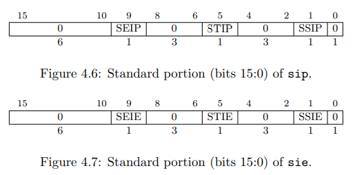
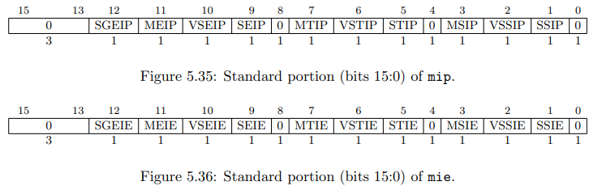
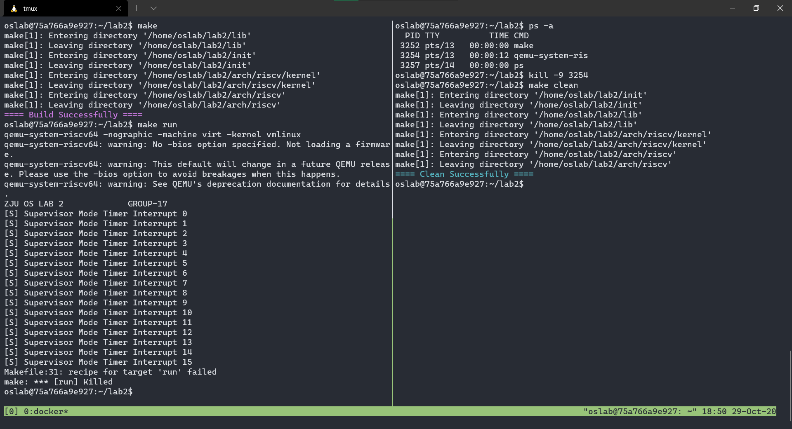
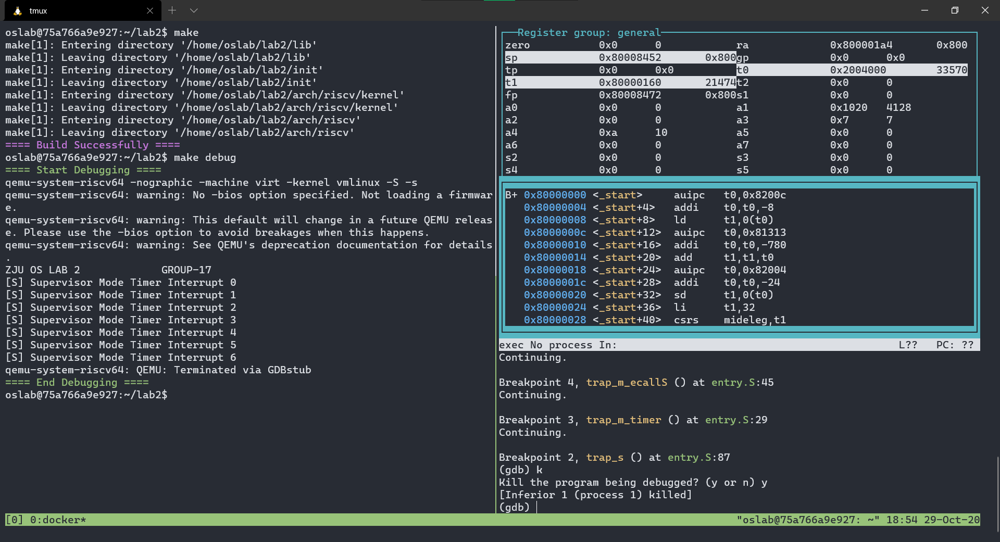
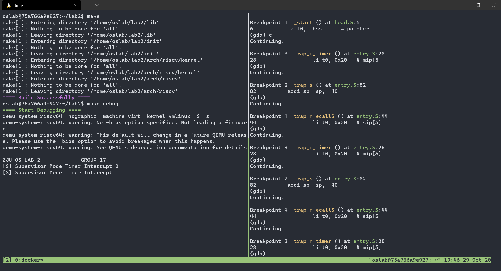

<center><font size=7>《操作系统》Lab2</font></center><br /><div align='right'><font size=4><b>陈希尧</b> 3180103012</font><br /><div align='right'><font size=4>Group17</font></div>

[TOC]

# Lab Basis

## Purpose

学习RISC-V相关知识，Makele相关知识，编写head.S实现bootloader的功能，并利用Makele来完成对整个工程的管理。

## Environment

OS: Ubuntu 18.04.5 LTS on Windows 10 x86_64 (WSL2)

Kernel: 4.19.128-microsoft-standard

Docker version 19.03.13

## Lab Principle

### Trap

异常(trap)是指是不寻常的运行时事件，由硬件或软件产生，当异常产生时控制权将会转移至异常处理程序。异常是操作系统最基础的概念，一个没有异常的操作系统无法进行正常交互。

RISC-V将异常分为两类。一类是硬件中断(interrupt)，它是与指令流异步的外部事件，比如鼠标的单击。另外一类是同步异常(exception)，这类异常在指令执行期间产生，如访问了无效的存储器地址或执行了具有无效操作码的指令时。

这里我们用异常(trap)作为硬件中断(interrupt)和同步异常(exception)的集合，另外trap指的是发生硬件中断或者同步异常时控制权转移到handler的过程。

### Trap in M mode

#### 异常需要的寄存器

Machine mode异常需要使用的寄存器首先有lab1提到的mstatus，mip，mie，mtvec寄存器，这些寄存器需要我 们操作；剩下还有mepc，mcause寄存器，这些寄存器在异常发生时硬件会自动置位，它们的功能如下：

* mepc（Machine Exception Program Counter）：通常指向异常处理后应该恢复执行的位置
* mcause（Machine Cause Register）：保存异常的种类，具体可以查看请参考The RISC-V Instruction Set Manual 3.1.16节（P.40）

事实上，异常还与mideleg和medeleg两个寄存器密切相关，它们的功能将在Supervisor mode下的异常部分讲 解。 与时钟中断相关的还有mtime和mtimecmp寄存器，它们的功能如下： 

* mtime（Machine Time Register）：保存时钟计数，这个值会由硬件自增 
* mtimecmp（Machine Time Compare Register）：保存需要比较的时钟计数，当mtime的值大于或等于 mtimecmp的值时，时钟中断触发

需要注意的是，mtime和mtimecmp寄存器需要用MMIO的方式即使用内存访问指令（sd，ld等）的方式交互，可以将它们理解为Machine mode下的一个外设。

#### 硬件中断的处理（以时钟中断为例）

简单地来说，中断处理经过了三个流程，中断触发，判断可以处理还是忽略，可以处理时调用处理函数。

1. 中断触发： 时钟中断的触发条件是这个hart（硬件线程）的时间比较器mtimecmp小于实数计数器mtime。
2. 判断是否可处理：当时钟中断触发时，并不一定会响应中断信号。Machine mode只有在全局中断使能位mstatus[mie]置位时才会产生中断，如果在Supervisor mode下触发了Machine mode的中断，此时无视mstatus[mie]直接响应，即运行在低权限模式下，高权限模式的全局中断使能位一直是enable状态。此外，每个中断在控制状态寄存器mie中都有自己的使能 位，对于特定中断来说，需要考虑自己对应的使能位，而控制状态寄存器mip中又指示目前待处理的中断。以时钟中断为例，只有当mstatus[mie]=1，mie[mtie]=1，且mip[mtip]=1时，才可以处理机器的时钟中断。其中mstatus[mie] 以及mie[mtie]需要我们自己设置，而mip[mtip]在中断触发时会被硬件自动置位。
3. 调用处理函数： 当满足对应中断的处理条件时，硬件首先会发生一些状态转换（参考中文手册10.3节），并跳转到对应的异常处理函数中，在异常处理函数中我们可以通过分析异常产生的原因判断具体为哪一种，然后执行对应的处理。为了处理异常结束后不影响hart正常的运行状态，我们首先需要保存当前的状态即上下文切换。我们可以先用栈上的一段空间 来把全部寄存器保存，保存完之后执行到我们编写的异常处理函数主体，结束后退出。函数调用规范可以参考中文开源手册3.2节。

#### 同步异常的处理

同步异常的触发条件是当前指令执行了未经定义的行为，比如Illegal instruction，也没有判断可以处理还是忽略 的步骤，硬件会直接经历一些状态转换，然后跳到对应的异常处理函数。又比如环境调用同步异常ecall主要是用于低 权限的mode需要高权限的mode的相关操作时使用的，比如U-mode call S-mode 通常用于使用系统调用，而S-mode call M-mode通常用于在S-mode操作某些硬件，这在本实验会用到。

需要注意的是，不管是中断还是同步异常，都会经历相似的硬件状态转换，并跳到同一个异常处理地址（由 mtvec/stvec指定），再由处理函数分析异常出现原因并进行不同的处理。

### Trap in S mode

S 模式不直接控制时钟中断和软件中断，而是使用 ecall 指令请求 M 模式设置定时器或代表它发送处理器间中断。该软件约定是监管者二进制接口(Supervisor Binary Interface)的一部分。

由于hart位于Supervisor mode，我们需要在Supervisor mode下处理异常。这时首先要提到委托（delegation）机制。

#### 委托（delegation）

RISC-V架构所有mode的异常在默认情况下都跳转到Machine mode处理。为了提高性能，RISC-V支持将低权限mode产生的异常委托给对应mode处理。这里使用了mideleg和medeleg两个寄存器，它们的功能如下：（更具体的介 绍参考The RISC-V Instruction Set Manual 3.1.8节）

* mideleg（Machine Interrupt Delegation）：控制将哪些异常委托给对应mode处理，它的结构可以参考mip寄存器，比如将mip中stip对应的位置位会将Supervisor mode的时钟中断委托给Supervisor mode处理 
* medeleg（Machine Exception Delegation）：控制将哪些异常委托给对应mode处理，它的各个位对应mcause寄存器的返回值

#### Supervisor Mode下时钟中断处理流程

事实上，虽然在mideleg中设置了将Supervisor mode产生的时钟中断委托给Supervisor mode，委托并没有完成。因为硬件产生的时钟中断仍会发到Machine mode（mtime寄存器是Machine mode的设备），所以我们需要手动触发Supervisor mode下的时钟中断。

此前，假设设置好[m|s]status以及[m|s]ie，即我们已经满足了时钟中断在两种mode下触发的使能条件。接下来 一个时钟中断的委托流程如下：

1. 当mtimecmp小于mtime时，触发时钟中断并且硬件自动置位mip[mtip]
2. 此时mstatus[mie]=1，mie[mtie]=1，且mip[mtip]=1 表示可以处理machine mode的时钟中断。
3. 此时hart发生了异常，硬件会自动经历状态转换，其中pc被设置被mtvec，即跳转到我们设置好的machine mode处理函数入口。
4. machine mode处理函数分析异常原因，判断为时钟中断，为了将时钟中断委托给supervisor mode，于是==将mip[stip]置位==，并且为了防止在supervisor mode处理时钟中断时继续触发machine mode时钟中断，于是同时==将mie[mtie]清零==。
5. machine mode处理函数处理完成并退出，此时sstatus[sie]=1，sie[stie]=1，且sip[stip]=1(由于sip是mip的子集， 所以第4步中令mip[stip]置位等同于将sip[stip]置位)，于是触发supervisor mode的时钟中断。
6. 此时hart发生了异常，硬件自动经历状态转换，其中pc被设置为stvec，即跳转到我们设置好的supervisor mode 处理函数入口。
7. supervisor mode处理函数分析异常原因，判断为时钟中断，于是进行相应的操作，完成后将sip[stip]清零，表示处理完毕，然后利用ecall触发异常，跳转到machine mode的异常处理函数进行最后的收尾。
8. machine mode异常处理函数分析异常原因，发现为ecall from S-mode，于是设置mtimecmp+=100000，并且设置mie[mtie]恢复machine mode的中断使能，保证下一次时钟中断可以触发。
9. 函数逐级返回，整个委托的时钟中断处理完毕。

**注意**

1. 时间中断必须在M模式下进行，然后再通过delegation分配给S模式进行处理

### Regs specification

#### mstatus/sstaus

mstatus[3]=mie

[m|s]status[1]=sie

#### mtime(cmp)

Machine Time Reg. Use MMIO to access. Function specified in [Trap](# 硬件中断的处理（以时钟中断为例）)

#### mideleg

Machine Trap Delegation Reg

Delegated interrupts result in the interrupt being masked at the delegator privilege level. For example, if the supervisor timer interrupt (STI) is delegated to S-mode by setting mideleg[5], STIs will not be taken when executing in M-mode. By contrast, if mideleg[5] is clear, STIs can be taken in any mode and regardless of current mode will transfer control to M-mode.

mideleg holds trap delegation bits for individual interrupts, with the layout of bits matching those in the mip register (i.e., STIP interrupt delegation control is located in bit 5).

mideleg（Machine Interrupt Delegation，机器中断委托）CSR 控制将哪些中断委托给 S 模式。与 mip 和 mie 一样，mideleg 中的每个位对应于图 10.3 中相同的异常。例如， mideleg[5]对应于 S 模式的时钟中断，如果把它置位，S 模式的时钟中断将会移交 S 模式的异常处理程序，而不是 M 模式的异常处理程序。 委托给 S 模式的任何中断都可以被 S 模式的软件屏蔽。sie（Supervisor Interrupt Enable，监管者中断使能）和 sip（Supervisor Interrupt Pending，监管者中断待处理）CSR 是 S 模式的控制状态寄存器，他们是 mie 和 mip 的子集。它们有着和 M 模式下相同的布局，但<u>在 sie 和 sip 中只有与由 mideleg 委托的中断对应的位才能读写</u>。那些没有被委派的中断对应的位始终为零。

#### mcause/scause

| reg    | Type         | Mode+Code |
| ------ | ------------ | --------- |
| mcause | M timer      | 1+7       |
| mcause | ecall from S | 0+9       |
| scause | S timer      | 1+5       |

#### sie/sip



#### mie/mip

mip寄存器用于查询中断的等待状态，软件可以通过读mip寄存器达到查询中断状态的结果。



### New Instructions

* ld rd, offset(rs1)
    * x[rd] = M\[x\[rs1\] + sext(offset)\]\[63:0\]
    * 双字加载 (Load Doubleword). I-type, RV32I and RV64I.
    * 从地址 x[rs1] + sign-extend(offset)读取八个字节，写入 x[rd]。
    * 压缩形式：c.ldsp rd, offset; c.ld rd, offset(rs1)
* sd rs2, offset(rs1)
    * M[x[rs1] + sext(offset) = x\[rs2][63:0]
    * 存双字(Store Doubleword). S-type, RV64I only.
    * 将 x[rs2]中的 8 字节存入内存地址 x[rs1]+sign-extend(offset)。
    * 压缩形式：c.sdsp rs2, offset; c.sd rs2, offset(rs1)
* auipc rd, immediate
    * x[rd] = pc + sext(immediate[31:12] << 12)
    * PC 加立即数 (Add Upper Immediate to PC). U-type, RV32I and RV64I.
    * 把符号位扩展的 20 位（左移 12 位）立即数加到 pc 上，结果写入 x[rd]。
* sret
    * ExceptionReturn(Supervisor)
    * 管理员模式例外返回(Supervisor-mode Exception Return). R-type, RV32I and RV64I 特权指令。
    * 从管理员模式的例外处理程序中返回，设置 pc 为 CSRs[spec]，权限模式为 CSRs[sstatus].SPP，CSRs[sstatus].SIE 为 CSRs[sstatus].SPIE，CSRs[sstatus].SPIE 为 1，CSRs[sstatus].spp 为 0。
    * The SRET instruction is used to return from a trap taken into HS-mode or VS-mode. Its behavior depends on the current virtualization mode.
* mret
    * ExceptionReturn(Machine)
    * 机器模式异常返回(Machine-mode Exception Return). R-type, RV32I and RV64I 特权架构
    * 从机器模式异常处理程序返回。将 pc 设置为 CSRs[mepc], 将特权级设置成 CSRs[mstatus].MPP, CSRs[mstatus].MIE 置成 CSRs[mstatus].MPIE, 并且将 CSRs[mstatus].MPIE 为 1;并且，如果支持用户模式，则将 CSR [mstatus].MPP 设置为 0。
    * The MRET instruction is used to return from a trap taken into M-mode. MRET first determines what the new operating mode will be according to the values of MPP and MPV in mstatus or mstatush, as encoded in Table 5.6. MRET then in mstatus/mstatush sets MPV=0, MPP=0, MIE=MPIE, and MPIE=1. Lastly, MRET sets the virtualization and privilege modes as previously determined, and sets pc=mepc.
    * mret 将 PC 设置为 mepc，通过将 mstatus 的 MPIE 域复制到 MIE 来恢复之前的中断使能设置，并将权限模式设置为 mstatus 的 MPP 域中的值。 这基本是前一段中描述的逆操作。
* ecall
    * RaiseException(EnvironmentCall)
    * 环境调用 (Environment Call). I-type, RV32I and RV64I.
    * 通过引发环境调用异常来请求执行环境。
* csrr rd, csr
    * x[rd] = CSRs[csr]
    * 读控制状态寄存器 (Control and Status Register Read). 伪指令(Pesudoinstruction), RV32I and RV64I.
    * 把控制状态寄存器 csr 的值写入 x[rd]，等同于 csrrs rd, csr, x0.


# Lab Steps

## Lab Env

```zsh
$ docker run --name lab2 -it -v /mnt/c/Users/Ulysses/OneDrive/Jun_A/OS/Lab/Lab2/source:/home/oslab/lab2 -u oslab -w /home/oslab/lab2 oslab:2020 /bin/bash # 使用--name命名
$ docker start lab2
$ docker exec -it -u oslab -w /home/oslab/lab2 lab2 bash
oslab@094e57b84b1c:~$ ls
lab0  lab2
oslab@094e57b84b1c:~$ cd lab2
oslab@094e57b84b1c:~/lab2$ ls
Makefile  arch  include  init  lib
```

## Bootloader

照着上次的修改，问题不大，需要注意的点都在[debug心得](# Problems(Debug))中写了，需要另外注意的点有：

* bss段需要初始化，可以通过循环存0实现
* mstatus.mpie需要置位，否则mret之后mstatus.mie会被复位，这点文档里没有说，要格外小心
* 那几个使能置位的注意第几位别弄错了就行

## strap

调用put库里的puts和puti接口即可

```c
void put_trap_s(void) {
    static int counter = 0;
    puts("[S] Supervisor Mode Timer Interrupt ");
    puti(counter++);
    puts("\n");
    return;
}
```

## Trap_m

### 基本框架

先把寄存器压栈，这里压了t0, t1, mcause, mepc四个，注意要先压通用寄存器，再用通用寄存器作为CSR的中转，出栈相反

首先判断是中断还是同步异常：

```assembly
csrr t0, mcause
srli t1, t0, 63    # t1 = MSB
andi t0, t0, 0xff  # t0 = code
beq t1, zero, trap_m_except

trap_m_int:
    ...

trap_m_except:
    ...
```

对于中断和异常，分别要判断其错误code是否和要求的一样，此处以同步异常类型的判断为例（注意同步异常的mepc要+4）：

```assembly
trap_m_except:
    la t1, mcause_ecallS
    beq t0, t1, trap_m_ecallS
    la ...
    beq ...
    j trap_m_except_end

    trap_m_ecallS:
        ...

    trap_m_otherExcept:
        ...

    trap_m_except_end:
            ld t0, 24(sp)
            addi t0, t0, 4  # mepc += 4
            sd t0, 24(sp)
```

### 时钟中断

任务如下：

1. 置位mip.stip，由于sip在M模式只读，所以要通过修改mip的方式来修改，目的是让trap_s能被调用，且保证scause=0x5（S模式时钟中断）
2. 复位mie.mtie，关闭这个之后，就不会再有M模式的时钟中断了，这样可以避免另外两个函数在处理时被这个中断干扰（但是由于我有用栈保护关键寄存器所以问题不大，除非压栈到一半的时候被调用）

### 来自S的ecall

1. 复位mip.stip，此步是为了避免trap_s被重复调用，文档上表达感觉不太对，要多加小心
2. 给mtimecmp加上time_sep，但是由于time_sep可能会太小（比运行这个循环所需时间还小）导致程序不断出发中断，因此我改为令mtimecmp = mtime + time_sep（虽然也不能完全解决这个问题，而且这两个load之间其实没差几个周期
3. 重新置位mie.mtie，以便于下一次时钟中断能正常调用trap_m

## Trap_s

压栈和框架和trap_m基本上是一样的，实际上要干的事情只有两行

```assembly
call put_trap_s
ecall
```

至于sip.stip的复位，我在trap_m_ecallS里实现了，因为trap_s的S模式下没办法修改sip.stip

## Debug

debug过程由于懒得每次都打一堆指令，于是在source文件夹下写了一个.gdbinit，然后用软链接`ln ~/lab2/.gdbinit ~/.gdbinit`，再在.bashrc里加一句`alias gdb=/opt/riscv/bin/riscv64-unknown-linux-gnu-gdb`即可直接通过`gdb vmlinux`这个指令来启动gdb了。

debug心得见[此处](# Problems(Debug))。

以下记录一些用到的指令：

```
gdb vmlinux -x .gdbinit

layout reg
layout asm
b _start
b start_kernel
b *0x800001c8
ni 10  # for asm
si 20  # for asm
x /d 0x200bff8
x /d 0x2004000
display (long)*0x200bff8
display (long)*0x2004000
x /b $mstatus
x $medeleg
i reg mtvec
n 10
s 10
p /d *0x2004000-*0x200bff8

# .gdbinit
set breakpoint pending on
set output-radix 10
target remote localhost:1234
layout reg
b _start
b trap_s
b trap_m_timer
b trap_m_ecallS
display (long)*0x200bff8
display (long)*0x2004000
```


# Lab Results



由截图可见可以正确编译、运行、清除文件（左侧分屏编译运行，右侧分屏kill并make clean），实验成功，其中打印的快慢可以通过修改lds文件中的`time_sep`符号的值来修改，具体的动态效果可以见视频。

可以正常debug，示意如下：





从调试结果可以看出，trap_m_timer, trap_s, trap_m_ecallS会被依次循环调用，符合要求。


# Problems & Thoughts

## 思考题

* 思考题：观察vmlinux和image，解释为什么要初始化bss段。
    * bss段存储未初始化的全局变量
    * 观察vmlinux中的`la t0, .bss`段，发现其反汇编后的指令为`auipc t0,0x0; addi t0,t0,1130`，所以用`display (int[100])*1130`查看这一段，发现数据本来就是0：`(int[100])*1130 = {0x0 <repeats 100 times>}`，这可能是因为ASLR没开（其实这个问题不大，只是我观察到的小问题）
    * 主要的原因是像`static int a = 0;`（即使初始化但值为0）这样的数据也会被放到bss段而不是data段，所以必须要对bss段及逆行初始化才能避免使用了错误的变量值。
* 思考题：当处理同步异常时应该在退出前给mepc+4，当处理中断时则不需要，请解释为什么要这样做。
    * 同步异常的话如果没+4，返回之后就会继续执行这句引起同步异常的指令(例如ecall)，然后继续同步异常的死循环，所以需要+4来跳过这句
    * 而中断的情况mepc对应的指令本身是没有问题的，因此被中断之后要重新执行这个语句，所以不能+4

## Problems(Debug)

记录debug遇到的问题和解决思路

1. mtvec和stvec设置错误，本来的地址分别是0xc4和0x118，结果由于用了vectorized模式，所以不能直接将pc跳转到BASE

2. 还是mtvec和stvec的问题，==这两个的BASE其实是字地址==，所以不需要左移两位（这也太坑了手册上只说了"4-byte aligned"，没说这是字地址啊。。。🤧）

3. 然后可以正常输出了，但是输出一次就又卡死了，这显然是设置mtimecmp出现错误造成的，我发现这也trap_s没法进入trap_m重设这个计时器寄存器，于是强制加了一个跳转，然后可以循环输出了，但是有以下问题：

    * 会把header也跟着一起输出

        * ```
            [S] Supervisor Mode Timer Interrupt 31ZJU OS LAB 2             GROUP-17
            [S] Supervisor Mode Timer Interrupt 32ZJU OS LAB 2             GROUP-17
            [S] Supervisor Mode Timer Interrupt 33ZJU OS LAB 2             GROUP-17
            ```
        
    * 速度非常快（通过手机秒表测量发现为0.01秒一个）
    * 无法通过^c终止
    
4. 分别解决

    * 太快的问题把1e+5的time_sep改成1e+7就正常一些了（一秒一个）
    * 另外两个问题经过debug发现是因为trap_s函数忘记返回了，由于编译完和start_kernel是连在一起的，所以从puts_trap_s函数返回之后直接进入了start_kernel函数执行
    
5. 后来换了个结构之后出现了新的问题，时钟中断没了，经过排查发现系统只会调用M模式的中断，不会调用S模式的中断，进一步发现mret的返回地址并不是mepc的值而是trap_m函数开头的位置，查阅资料得知mret要满足条件才能跳转。且<u>重新debug发现在bootloader的S_Mode前面那个mret之后MPP就成了00(U mode)</u>

6. 后来发现是由于将M模式的计时器中断和ecall from S分离之后导致每次机器模式计时器中断没有更新mtimecmp，重新call一次更新的即可实现机器模式下的正常输出。

7. 接着的问题是只能进入M模式的中断不能进入S模式的，按照[原理部分](# Supervisor Mode下时钟中断处理流程)检查了一遍之后发现是`mip.stip`也需要置位，但问题是我加入了将它置位的代码之后，打印的速度忽然变得非常之快。经过debug发现，`trap_s`只会停止一次，只后就不会再停，这是因为中间的`ecall_from_S`函数中计时寄存器设置出现了错误

8. 直到这里我才知道题目的意思是trap_m是个单独的函数，其中有两个分支分别处理计时器中断和来自S的ecall，但是修改之后不知道哪里错了，trap_s不会再被中断调用了。后来发现是由于寄存器使用t0和t1弄混了导致CSR没有被正确置位。

9. ==MTIP is read-only in mip==

10. 先后尝试了用mip.mtip、mtime和mtimecmp来判断M的中断类型，==M的中断类型用mcause来判断==

11. ==If supervisor mode is not implemented, bits SEIP, STIP, and SSIP of mip and SEIE, STIE, and SSIE of mie are hardwired to zeros.==

12. mideleg, mstatus.mpp, sie均不能被修改

13. 调用了trap_m，但是mcause为"Timer Int from S"，说明委托失败了（但是S时钟中断成功）

14. ==同步中断返回之前要+4，不然会一直ecall==

15. trap_m时的mcause一直是0x9，所以会一直调用ecallS一直打印（并且除了第一次之前的打印，其他的间隔无法通过time_sep控制）

16. ==在mret到S_Mode后mstatus.mie会被置0==，这是因为mret时`mstatus.mie<--mstatus.mpie`，即实验一中那个因为文档写错了一直找不到的mipe。

17. S模式下sip没有被正常置位，因此trap_S刚返回就被调用，一直给mtimecmp自增，mtimecmp没有比mtime小的机会，因此mtip没有被置位的机会。

     * 和mtip一样，stip是只读的：==If implemented, STIP is read-only in sip, and is set and cleared by the execution environment.==
     * 勘误：实验手册上“7. supervisor mode处理函数分析异常原因，判断为时钟中断，于是进行相应的操作，完成后将sip[stip]清零，表示处理完毕，然后利用ecall触发异常，跳转到machine mode的异常处理函数进行最后的收尾。”这个说法存在一定的误导性。首先sip.stip在S模式下是只读的，其次即使进入了M模式，也不能直接修改sip.stip，正确方式是通过ecall进入M模式，然后置位mip.stip。根本不是什么“先清零再利用ecall”。

## Thoughts

CSR的设置的时候第几位要置位、使用csrc还是csrs千万小心，写错了好几个地方。其他种种问题debug得反正很心累，基本上都记录在上面了。最后总算是搞出来了，但是花了太多时间在做这个，感觉很受打击。

本次实验学习了RISC-V下中断和同步异常的底层调用和判断的方法，并且对寄存器和指令的了解更加深入，对RISC-V的体系架构也有了更深入的理解，相信本次实验对我以后的在硬件方面的学习有很大帮助。

## Suggestions

虽然老师觉得这些实验没什么难度（确实），但是每次实验都有很多（非常多）坑要踩，建议以后可以在实验指南里列出一些必踩中的坑（比如CSR这种底层寄存器的使用限制太多了，有时候你以为你写进去了其实它是只读的，建议这方面能多一点tips），否则需要花超额的学习时间在OS的实验上。即使没有多一点tips也希望能不要有错（比如sip.stip是只读这个问题，因为我是按照手册来的，所以完全没想到会错，花了好长时间在找这个bug）


# Appendix

## Reference

[M mode Timer Interrupt](http://zju.phvntom.tech/markdown/md2html.php?id=md/RISC-V-Timer.md)

[Beginner trying to set up timer IRQ in assembler: how to print CSRs in GDB? - HiFive1 Rev B - SiFive Forums](https://forums.sifive.com/t/beginner-trying-to-set-up-timer-irq-in-assembler-how-to-print-csrs-in-gdb/2764/2)

[RISC-V异常与中断机制概述 | SunnyChen的小窝](http://www.sunnychen.top/2019/07/06/RISC-V%E5%BC%82%E5%B8%B8%E4%B8%8E%E4%B8%AD%E6%96%AD%E6%9C%BA%E5%88%B6%E6%A6%82%E8%BF%B0/)

（后面其他debug过程中查的资料就没有记录了，spec也派上了很大用场

## Code

### strap.c

```c
#include "put.h"

void put_trap_s(void) {
    static int counter = 0;
    puts("[S] Supervisor Mode Timer Interrupt ");
    puti(counter++);
    puts("\n");
    return;
}
```

### head.S

```assembly
.section .text.init

.global _start
_start:
    # init .bss
    la t0, .bss      # pointer
    la t1, bss_size  # counter
    bss_init_loop:
        sb zero, 0(t0)
        addi t0, t0, 1
        addi t1, t1, -1
        bne t1, zero, bss_init_loop

    # set mtimecmp to mtime+time_sep
    la t0, mtime_addr  # RV64, t0 is of 64 bit
    ld t1, 0(t0)       # mtime->t1
    la t0, time_sep
    add t1, t1, t0
    la t0, mtimecmp_addr
    sd t1, 0(t0)

    # set time int delegation
    li t1, 0x20  # mi[e|p][5]=sti[e|p]
    csrs mideleg, t1

    # set mstatus.mpie
    li t1, 0x80  # mstatus[7]
    csrs mstatus, t1

    # set mstatus.mie, mie.mtie, sstatus.sie, sie.stie
    li t1, 0x8   # mstatus[3]
    csrs mstatus, t1
    li t1, 0x80  # mie[7]
    csrs mie, t1
    li t1, 0x2   # sstatus[1]
    csrs sstatus, t1
    li t1, 0x20  # sie[5]
    csrs sie, t1

    # set mtvec(M mode)
    la t1, trap_m  # mode = directed
    csrw mtvec, t1

    # switch from M to S
    li t1, 0x1000  # MPP[1] = 0
    csrc mstatus, t1
    li t1, 0x800   # MPP[0] = 1
    csrs mstatus, t1

    la t1, S_Mode
    csrw mepc, t1
    mret

S_Mode:
    # set stvec(S mode)
    la t1, trap_s  # mode = directed
    csrw stvec, t1

    # set sp
    la sp, stack_top

    # jump to start_kernel in main.c
    call start_kernel

.global _end
_end:
```

### entry.S

```assembly
.section .text.entry

.global trap_m
trap_m:
    # Save regs
    addi sp, sp, -32
    sd t0, 0(sp)
    sd t1, 8(sp)
    csrr t0, mcause
    sd t0, 16(sp)
    csrr t0, mepc
    sd t0, 24(sp)

    csrr t0, mcause
    srli t1, t0, 63    # t1 = MSB
    andi t0, t0, 0xff  # t0 = code
    beq t1, zero, trap_m_except

    trap_m_int:
        la t1, mcause_MTimer
        beq t0, t1, trap_m_timer
        j trap_m_end

        trap_m_timer:
            # enable mip.stip
            li t0, 0x20   # mip[5]
            csrs mip, t0  # For trap_s

            # clear mie.mtie
            li t0, 0x80
            csrc mie, t0

            j trap_m_end

    trap_m_except:
        la t1, mcause_ecallS
        beq t0, t1, trap_m_ecallS
        j trap_m_except_end

        trap_m_ecallS:
            # !!!!!! clear mip.stip !!!!!!
            li t0, 0x20   # sip[5]
            csrc mip, t0  # Stop from calling trap_s

            # set mtimecmp += time_sep, hardware will clear mip.mtip
            la t0, mtime_addr
            ld t0, 0(t0)    # t0 = mtimecmp
            la t1, time_sep
            add t1, t0, t1  # t1 = mtimecmp+sep
            la t0, mtimecmp_addr
            sd t1, 0(t0)

            # enable mie.mtie
            li t0, 0x80
            csrs mie, t0

            j trap_m_except_end

        trap_m_except_end:
            ld t0, 24(sp)
            addi t0, t0, 4  # mepc += 4
            sd t0, 24(sp)

    trap_m_end:
    # Get regs back
    ld t0, 24(sp)
    csrw mepc, t0
    ld t0, 16(sp)
    csrw mcause, t0
    ld t1, 8(sp)
    ld t0, 0(sp)
    addi sp, sp, 32

    mret


.global trap_s
trap_s:
    # Save regs
    addi sp, sp, -40
    sd t0, 0(sp)
    sd t1, 8(sp)
    csrr t0, scause
    sd t0, 16(sp)
    csrr t0, sepc
    sd t0, 24(sp)

    csrr t0, scause
    srli t1, t0, 63    # t1 = MSB
    andi t0, t0, 0xff  # t0 = code
    beq t1, zero, trap_s_except

    trap_s_int:
        la t1, scause_STimer
        beq t0, t1, trap_s_timer
        j trap_s_end

        trap_s_timer:
            call put_trap_s
            ecall

            j trap_s_end

    trap_s_except:

        j trap_s_except_end  # No implementation yet

        trap_s_except_end:
            ld t0, 24(sp)
            addi t0, t0, 4  # sepc += 4
            sd t0, 24(sp)

    trap_s_end:
    # Get regs back
    ld t0, 24(sp)
    csrw sepc, t0
    ld t0, 16(sp)
    csrw scause, t0
    ld t1, 8(sp)
    ld t0, 0(sp)
    addi sp, sp, 40

    sret
```

### vmlinux.lds

```
OUTPUT_ARCH( "riscv" )
ENTRY( _start )
BASE_ADDR = 0x80000000;
SECTIONS
{
    . = BASE_ADDR;
    .text : {
        *(.text.init)
        *(.text.entry)
        *(.text)
        }
    .rodata : { *(.rodata) }
    .data : { *(.data) }
    .bss : { *(.bss) }
    . += 0x8000;
    stack_top = .;
    _end = .;

    bss_size = 0x100;
    mtime_addr = 0x200bff8;
    mtimecmp_addr = 0x2004000;
    time_sep = 1000000;
    mcause_MTimer = 0x7;
    mcause_ecallS = 0x9;
    scause_STimer = 0x5;
}
```

