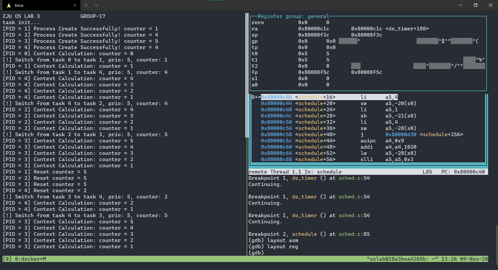
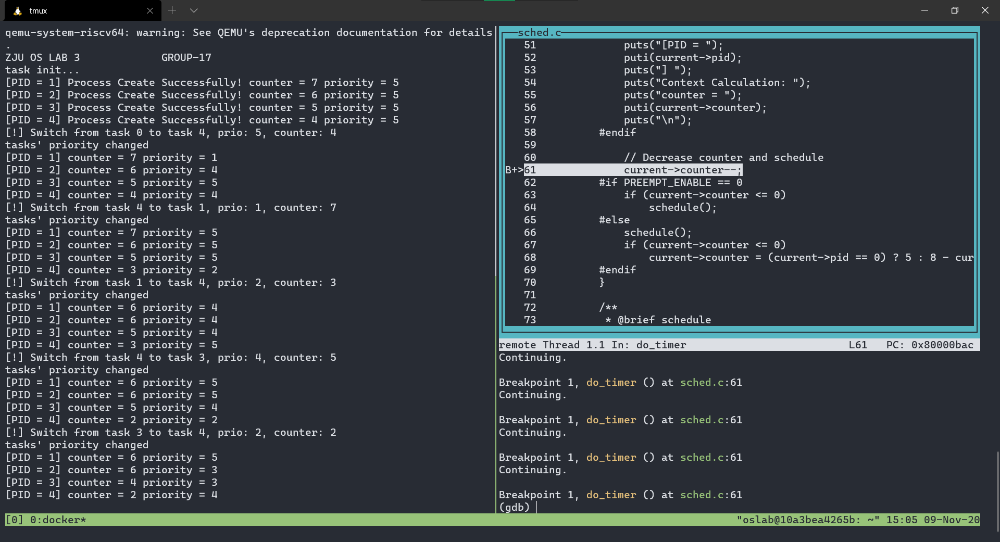

<center><font size=7>《操作系统》Lab2</font></center><br /><div align='right'><font size=4><b>陈希尧</b> 3180103012</font><br /><div align='right'><font size=4>Group17</font></div>

[TOC]

# Lab Basis

## Purpose

结合课堂所学习的相关内容，在上⼀实验实现中断的基础上进一步地实现简单的进程调度

## Environment

OS: Ubuntu 18.04.5 LTS on Windows 10 x86_64 (WSL2)

Kernel: 4.19.128-microsoft-standard

Docker version 19.03.13

## Lab Principle

### Embedded Asm

格式如下：

`指令部分：输出部分：输入部分：损坏部分`

Ex: `__asm__ __volatile__("asm \nasm \n" : "=r"(c var) : "r"(c var) : "r0", "r1");`

第一个冒号表示从汇编里输出到c语言的变量，=号表示在汇编里只能改变C变量的值，而不能取它的值。+号表示可以取变量值，也可改变变量的值。r表示在汇编里用一个通用寄存器代替c变量。

第二个冒号表示汇编里只能取c变量的值, 不能再有"=","+"号

第三个冒号表示告诉编译器不要把r0, r1寄存器分配给%0, %1等

**限制符**

分类            限定符                    描述
通用寄存器       "a"               将输入变量放入eax
这里有一个问题：假设eax已经被使用，那怎么办？
其实很简单：因为GCC 知道eax 已经被使用，它在这段汇编代码
的起始处插入一条语句pushl %eax，将eax 内容保存到堆栈，然
后在这段代码结束处再增加一条语句popl %eax，恢复eax的内容
"b"               将输入变量放入ebx
"c"               将输入变量放入ecx
"d"                将输入变量放入edx
"s"               将输入变量放入esi
"d"               将输入变量放入edi
"q"              将输入变量放入eax，ebx，ecx，edx中的一个
"r"               将输入变量放入通用寄存器，也就是eax，ebx，ecx，
edx，esi，edi中的一个
"A"              把eax和edx合成一个64 位的寄存器(use long longs)
内存             "m"             内存变量
"o"             操作数为内存变量，但是其寻址方式是偏移量类型，
也即是基址寻址，或者是基址加变址寻址
"V"             操作数为内存变量，但寻址方式不是偏移量类型
" "             操作数为内存变量，但寻址方式为自动增量
"p"             操作数是一个合法的内存地址（指针）
寄存器或内存     "g"             将输入变量放入eax，ebx，ecx，edx中的一个
或者作为内存变量
"X"            操作数可以是任何类型
立即数
"I"             0-31之间的立即数（用于32位移位指令）
"J"             0-63之间的立即数（用于64位移位指令）
"N"             0-255之间的立即数（用于out指令）
"i"             立即数  
"n"            立即数，有些系统不支持除字以外的立即数，
这些系统应该使用"n"而不是"i"
匹配             " 0 "，         表示用它限制的操作数与某个指定的操作数匹配，
"1" ...               也即该操作数就是指定的那个操作数，例如"0"
"9"            去描述"％1"操作数，那么"%1"引用的其实就
是"%0"操作数，注意作为限定符字母的0－9 与
指令中的"％0"－"％9"的区别，前者描述操作数，
后者代表操作数。
&                     该输出操作数不能使用过和输入操作数相同的寄存器
操作数类型         "="          操作数在指令中是只写的（输出操作数）  
"+"          操作数在指令中是读写类型的（输入输出操作数）
浮点数             "f"          浮点寄存器
"t"           第一个浮点寄存器
"u"          第二个浮点寄存器
"G"          标准的80387浮点常数
%                   该操作数可以和下一个操作数交换位置
例如addl的两个操作数可以交换顺序
（当然两个操作数都不能是立即数）

#                   部分注释，从该字符到其后的逗号之间所有字母被忽略
*                     表示如果选用寄存器，则其后的字母被忽略

# Lab Steps

## Lab Env

```zsh
$ docker run --name lab3 -it -v /mnt/c/Users/Ulysses/OneDrive/Jun_A/OS/Lab/Lab3/Lab3_3180103012:/home/oslab/lab3 -u oslab -w /home/oslab/lab3 oslab:2020 /bin/bash # 使用--name命名
$ docker start lab3
$ docker exec -it -u oslab -w /home/oslab/lab3 lab3 bash
```

## Trap

修改中断处理程序，将也[m|s]epc也压栈（由于我在Lab2中已实现，因此此处不再修改）：

```assembly
csrr t0, sepc
sd t0, 0(sp)

# ...

ld t0, 0(sp)
csrw mepc, t0
```

## SJF

## PRIORITY

## Debug

补充一些新的指令：

```
layout src
b sched:73
```


# Lab Results

## Program

### SJF



如图，由于随机种子是给定的，因此产生的随机数也是给定的，因此调度结果和实验手册上的完全一样

### PRIORITY



同理，和实验手册给出的输出相同

# Problems & Thoughts

## 思考题


## Problems(Debug)

1. 由于`TASK_RUNNING`是0，因此没分配空间的其他task们的state基本上都是0，所以遍历的时候不能64个全部遍历，只能遍历有分配内存的那几个。
2. 本来用两个函数把context switch的东西放进去，结果后来`context_load`会有越界访问，debug发现是因为参数`pTask`是存在s0里的，这样搞会直接把pTask的值改掉。改成使用宏函数可解决问题。
3. 原本没写`ra, sp, s0~s11`的contex switch部分，能够正常输出，写了之后变成会一直重复输出"ZJU OS LAB 3"和"task init..."。
4. 猜测是因为没有初始化`task[]->thread`中内容，尝试在task_init之后加一次`context_save`，但是出现了pc越界的情况，后来发现是sp的问题，由于sp的改变，从栈中恢复的ra是错误的，因此ret回到错误的地方。
    * 若load和save忽略掉sp，则程序是正常的，因此确定了是sp的问题造成的。
    * 因此手动用汇编写了个`sp+=32; ret;`放在`switch_to`结束之前。但是SJF又回到了重复输出"ZJU OS LAB 3"和"task init..."的状态。
5. 

## Thoughts

按照要求来写没有问题，

## Suggestions


# Appendix

## Reference

[assembly - Context saving – how to read segment registers in C and instruction pointer? - Stack Overflow](https://stackoverflow.com/questions/54488861/context-saving-how-to-read-segment-registers-in-c-and-instruction-pointer)

## Code

