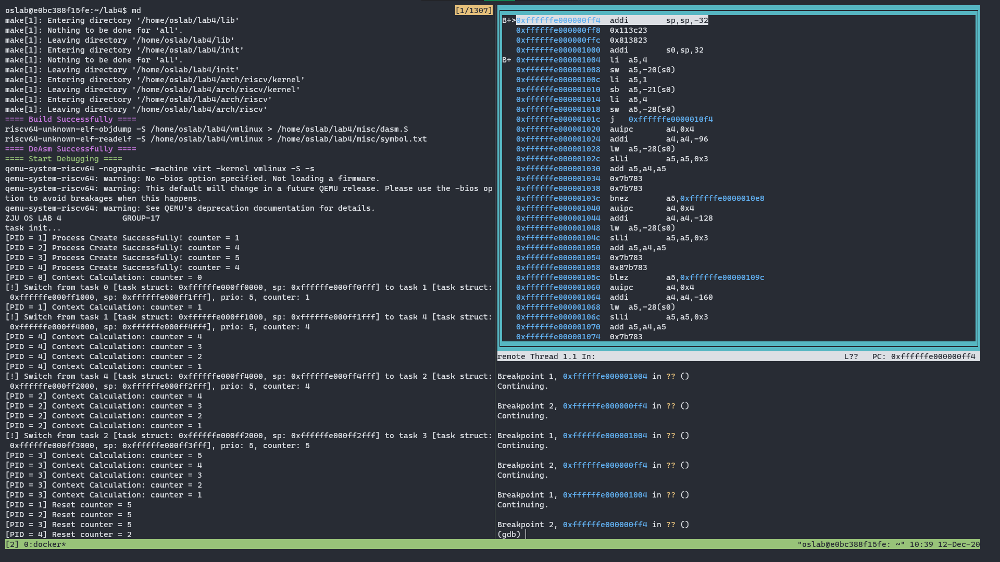
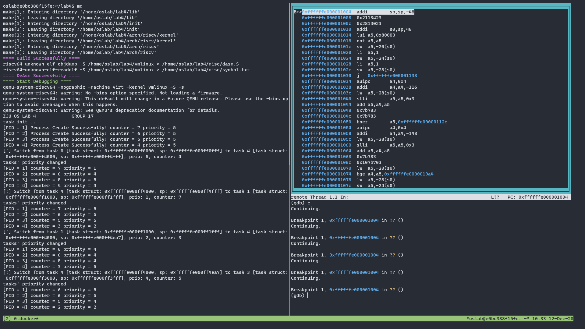

<center><font size=7>《操作系统》Lab4</font></center><br /><div align='right'><font size=4><b>陈希尧</b> 3180103012</font><br /><div align='right'><font size=4>Group17</font></div></div>

[TOC]

# Lab Basis

## Purpose

结合课堂学习的页式内存管理以及虚拟内存的相关知识，尝试在已有的程序上开启 MMU 并实现页映射，保证之前的进程调度能在虚拟内存下正常运行

## Environment

OS: Ubuntu 18.04.5 LTS on Windows 10 x86_64 (WSL2)

Kernel: 4.19.128-microsoft-standard

Docker version 19.03.13

## Lab Principle

### VM
&emsp;&emsp;MMU（Memory Management Unit），负责`虚拟地址`到`物理地址`的转换。程序在cpu上运行时，他使用的虚拟地址会由MMU进行翻译。为了加速地址翻译的过程，现代cpu都引入了TLB（Translation Lookaside Buffer）。
&emsp;&emsp;分页机制的基本思想是将程序的虚拟地址空间划分为连续的，等长的虚拟页。`虚拟页和物理页的页长固定且相等`（一般情况下为4kb），从而操作系统可以方便的为每个程序构造页表，即虚拟页到物理页的映射关系。
&emsp;&emsp;逻辑上，该机制下的虚拟地址有两个部分组成：`1.虚拟页号`；`2.页内偏移`；在具体的翻译过程中，MMU首先解析得到虚拟地址中的虚拟页号，并通过虚拟页号查找到对应的物理页，最终用该物理页的起始地址加上页内偏移得到最终的物理地址。

### Sv39
#### satp
```c
 63      60 59                  44 43                                0
 ---------------------------------------------------------------------
|   MODE   |         ASID         |                PPN                |
 ---------------------------------------------------------------------
```
* MODE 字段的取值如下图：
```c
                             RV 64
     ----------------------------------------------------------
    |  Value  |  Name  |  Description                          |
    |----------------------------------------------------------|
    |    0    | Bare   | No translation or protection          |
    |  1 - 7  | ---    | Reserved for standard use             |
    |    8    | Sv39   | Page-based 39 bit virtual addressing  | <-- 我们使用的mode
    |    9    | Sv48   | Page-based 48 bit virtual addressing  |
    |    10   | Sv57   | Page-based 57 bit virtual addressing  |
    |    11   | Sv64   | Page-based 64 bit virtual addressing  |
    | 12 - 13 | ---    | Reserved for standard use             |
    | 14 - 15 | ---    | Reserved for standard use             |
     -----------------------------------------------------------
```
* ASID (Address Space Identifier) ： 用来区分不同的地址空间，此次实验中直接置0即可。
* PPN (Physical Page Number) ：顶级页表的物理页号，通常 `PPN = physical address >> 12`。
#### VA & PA
```c
     38        30 29        21 20        12 11                           0
     ---------------------------------------------------------------------
    |   VPN[2]   |   VPN[1]   |   VPN[0]   |          page offset         |
     ---------------------------------------------------------------------
                            Sv39 virtual address

```

```c
 55                30 29        21 20        12 11                           0
 -----------------------------------------------------------------------------
|       PPN[2]       |   PPN[1]   |   PPN[0]   |          page offset         |
 -----------------------------------------------------------------------------
                            Sv39 physical address

```
&emsp;&emsp;Sv39模式定义物理地址有56位，虚拟地址有64位。但是，虚拟地址的64位只有39位有效，63-39位在本次实验中（高地址映射）需要为1保证地址有效。Sv39支持三级页表结构，VPN[2-0](Virtual Page Number)分别代表每级页表的`虚拟页号`，PPN[2-0](Physical Page Number)分别代表每级页表的`物理页号`。物理地址和虚拟地址的低12位表示页内偏移（page offset）。


#### Sv39 PTE
* 0 ～ 9 bit: protection bits
    * V: 有效位，当 V = 0, 访问该PTE会产生Pagefault。
    * R: R = 1 该页可读。
    * W: W = 1 该页可写。
    * X: X = 1 该页可执行。
    * U,G,A,D,RSW本次实验中设置为0即可。

#### Addr Translation

* ==1.从satp的`PPN`中获取根页表的物理地址。==
* 2.通过pagetable中的VPN段,获取PTE。(可以把pagetable看成一个数组，VPN看成下标。PAGE_SIZE为4KB，PTE为64bit(8B), 所以一页中有4KB/8B=512个PTE，而每级VPN刚好有9位，与512个PTE一一对应)。
* 3.检查PTE的 `V bit`，如果不合法，应该产生page fault异常。
* 4.检查PTE的`RWX`bits,如果全部为0，则从PTE中的PPN[2-0]得到的是下一级页表的物理地址，则回到第二步。否则当前为最后一级页表，PPN[2-0]得到的是最终物理页的地址。
* 5.将得到最终的物理页地址，与偏移地址相加，得到最终的物理地址。
(以上为简要的地址翻译过程，完整过程[参考这里](http://www.five-embeddev.com/riscv-isa-manual/latest/supervisor.html#sv32algorithm))

### VA Translation

A virtual address *va* is translated into a physical address *pa* as follows:

1. Let *a* be ${\tt satp}.ppn \times \textrm{PAGESIZE}$, and let *i* = LEVELS − 1. (For Sv32, PAGESIZE=212 and LEVELS=2.)
2. Let *pte* be the value of the PTE at address *a* + *va*.*vpn*[*i*] × PTESIZE. (For Sv32, PTESIZE=4.) If accessing *pte* violates a PMA or PMP check, raise an access-fault exception corresponding to the original access type.
3. If *pte*.*v* = 0, or if *pte*.*r* = 0 and *pte*.*w* = 1, stop and raise a page-fault exception corresponding to the original access type.
4. Otherwise, the PTE is valid. If *pte*.*r* = 1 or *pte*.*x* = 1, go to step 5. Otherwise, this PTE is a pointer to the next level of the page table. Let *i* = *i* − 1. If *i* < 0, stop and raise a page-fault exception corresponding to the original access type. Otherwise, let *a* = *pte*.*ppn* × PAGESIZE and go to step 2.
5. A leaf PTE has been found. Determine if the requested memory access is allowed by the *pte*.*r*, *pte*.*w*, *pte*.*x*, and *pte*.*u* bits, given the current privilege mode and the value of the SUM and MXR fields of the `mstatus` register. If not, stop and raise a page-fault exception corresponding to the original access type.
6. If *i* > 0 and *pte*.*ppn*[*i* − 1 : 0] ≠ 0, this is a misaligned superpage; stop and raise a page-fault exception corresponding to the original access type.
7. If *pte*.*a* = 0, or if the memory access is a store and *pte*.*d* = 0, either raise a page-fault exception corresponding to the original access type, or:
    * Set *pte*.*a* to 1 and, if the memory access is a store, also set *pte*.*d* to 1.
    * If this access violates a PMA or PMP check, raise an access-fault exception corresponding to the original access type.
    * This update and the loading of *pte* in step 2 must be atomic; in particular, no intervening store to the PTE may be perceived to have occurred in-between.
8. The translation is successful. The translated physical address is given as follows:
    * *pa.pgoff* = *va.pgoff*.
    * If *i* > 0, then this is a superpage translation and *pa*.*ppn*[*i* − 1 : 0] = *va*.*vpn*[*i* − 1 : 0].
    * *pa*.*ppn*[LEVELS − 1 : *i*] = *pte*.*ppn*[LEVELS − 1 : *i*].

### New Register

#### medeleg

medeleg has a bit position allocated for every synchronous exception shown in Table 3.6 on page 40, with the index of the bit position equal to the value returned in the mcause register (i.e., setting bit 8 allows user-mode environment calls to be delegated to a lower-privilege trap handler).

#### mscratch

The mscratch register is an MXLEN-bit read/write register dedicated for use by machine mode. Typically, it is used to hold a pointer to a machine-mode hart-local context space and swapped with a user register upon entry to an M-mode trap handler.

### New Instructions

* csrrw rd, csr, zimm[4:0]
    * t = CSRs[csr]; CSRs[csr] = x[rs1]; x[rd] = t
    * 读后写控制状态寄存器 (Control and Status Register Read and Write). I-type, RV32I and RV64I. 记控制状态寄存器 csr 中的值为 t。把寄存器 x[rs1]的值写入 csr，再把 t 写入 x[rd]。
* auipc rd, immediate
    * x[rd] = pc + sext(immediate[31:12] << 12)
    * PC 加立即数 (Add Upper Immediate to PC). U-type, RV32I and RV64I.
    * 把符号位扩展的 20 位（左移 12 位）立即数加到 pc 上，结果写入 x[rd]。
* sfence.vma rs1, rs2
    * Fence(Store, AddressTranslation)
    * 虚拟内存屏障(Fence Virtual Memory). R-type, RV32I and RV64I 特权指令。
    * 根据后续的虚拟地址翻译对之前的页表存入进行排序。当 rs2=0 时，所有地址空间的翻译都 会受到影响；否则，仅对 x[rs2]标识的地址空间的翻译进行排序。当 rs1=0 时，对所选地址 空间中的所有虚拟地址的翻译进行排序；否则，仅对其中包含虚拟地址 x[rs1]的页面地址翻 译进行排序。

# Lab Steps

## Lab Env

```zsh
$ docker run --name lab4 -it -v /mnt/c/Users/Ulysses/OneDrive/Jun_A/OS/Lab/Lab4/lab4_3180103012:/home/oslab/lab4 -u oslab -w /home/oslab/lab4 oslab:2020 /bin/bash
$ docker start lab4
$ docker exec -it -u oslab -w /home/oslab/lab4 lab4 bash
oslab@10a3bea4265b:~/lab4$ ln -s ~/lab4/.gdbinit ~/.gdbinit
oslab@10a3bea4265b:~/lab4$ sed -i '$a\\nalias gdb=/opt/riscv/bin/riscv64-unknown-linux-gnu-gdb' ~/.bashrc
oslab@10a3bea4265b:~/lab4$ sed -i '$aalias gdb=/opt/riscv/bin/riscv64-unknown-linux-gnu-objdump' ~/.bashrc
```

## Manual

[oslab20fall - Wiki - Gitee.com](https://gitee.com/zjuicsr/lab20fall-stu/wikis/lab4)

## Implementation

### kalloc & memset

实现存储页表的物理内存空间的分配，首先需要维护一个free_list，结构定义如下：

```c
struct free_list_node {
    void *base;
    size_t limit;
    struct free_list_node *next;
};
```

在此基础上自己实现一个分配函数：

```c
void *kalloc_byte(size_t size) {
    static struct free_list_node first_node;
    static struct free_list_node *free_list = NULL;
    if (free_list == NULL) {  // Init
        free_list = &first_node;
        asm("la t0, rt_pg_addr");
        asm("sd t0, %0" ::"m"(free_list->base));
        free_list->limit = FREE_SPACE_SIZE;
        free_list->next  = NULL;
    }
    for (struct free_list_node *p = free_list; p; p = free_list->next)
        if (p->limit >= size) {
            p->limit -= size;
            return (void *)((uint8 *)(p->base = (uint8 *)p->base + size) - size);
        } else
            return NULL;
}
```

由于c没有面向对象特性的构造函数，因此首次进入要初始化free_list，将基地址设为之后satp要存的地址，大小根据计算给定合适的大小，next设为NULL（<u>其实由于没有资源的回收所以没有碎片化，只需要一个node就行，这个结构其实是个只有一个node的伪list</u>）。并且此处是从低地址开始向高地址进行分配，避免出现<a href="#内存不足">下文</a>提到的内存不足的问题（不怕FREE_SPACE_SIZE过大）

然后实现memset_byte函数，以字节为单位对内存空间进行初始化：

```c
void memset_byte(void *s, uint8 c, size_t n) {
    for (int i = 0; i < n; i++)
        *((uint8 *)s + i) = c;
}
```

### Page walk

实现page walk的过程，此处是为从1级页表开始进行page walk，最后返回值的3级页表的页表项的地址，在page walk的过程中如果遇到invalid的PTE还会创建新页表：

```c
uint64 *page_walk(uint64 *pgtbl, uint64 va) {
    for (int level = 2; level > 0; level--) {
        uint64 *pte_addr;
        switch (level) {
            case 2: pte_addr = &pgtbl[VAtoVPN2(va)]; break;
            case 1: pte_addr = &pgtbl[VAtoVPN1(va)]; break;
        }
        // Update `pgtbl` to be next level's pg tbl's base
        if (PTEtoV(*pte_addr)) {  // Valid PTE, next level PT has been constructed
            pgtbl = (uint64 *)(PTEtoPPN(*pte_addr) << 12);
        } else {  // Invalid PTE, need to construct next level PT
            if ((pgtbl = (uint64 *)kalloc_byte(PAGE_SIZE)) == NULL) {
                puts("\n[!] Insufficient Free Space.\n");
                return NULL;  // Insufficient free space for pg tbls
            }
            memset_byte(pgtbl, 0, PAGE_SIZE);
            LoadPTE(pte_addr, PAtoPPN((uint64)pgtbl), 0, 1);  // PTE <- next level pg's PPN
        }
    }
    return &pgtbl[VAtoVPN0(va)];
}
```

此处需要用的一些转换都用宏函数实现了，如下：

```c
#define Page_Floor(__addr) ((uint64)(__addr) & ~(uint64)(PAGE_SIZE - 1))

#define VAtoVPN2(__va) (((uint64)(__va) >> 30) & (PAGE_ENTRY_NUM - 1))
#define VAtoVPN1(__va) (((uint64)(__va) >> 21) & (PAGE_ENTRY_NUM - 1))
#define VAtoVPN0(__va) (((uint64)(__va) >> 12) & (PAGE_ENTRY_NUM - 1))

#define PAtoPPN(__pa) (((uint64)(__pa) >> 12) & 0xfffffffffff)  // PPN need no division

// PROT = {RSW, D, A, G, U, X, W, R, V} = {6'b0, PERM_X|W|R, V}
#define LoadPTE(__pte_addr, __ppn, __perm, __v)                                     \
    {                                                                               \
        *__pte_addr = ((uint64)(*(__pte_addr)) & 0xffc0000000000000) |              \
                      ((uint64)(__ppn) << 10) | ((uint64)(__perm) | (uint64)(__v)); \
    }

#define PTEtoPPN(__pte) (((uint64)(__pte) >> 10) & 0xfffffffffff)
#define PTEtoV(__pte) ((_Bool)((uint64)(__pte)&0x1))
```

实现本身并没有难度（我debug从头到尾没改过这部分的逻辑）

### Create mapping

同样逻辑也非常简单，遍历给定范围内的所有页表的基地址（物理和虚拟），调用page walk得到第三级页表项的地址，然后直接给PTE赋值：

```c
void create_mapping(uint64 *pgtbl, uint64 va, uint64 pa, uint64 sz, int perm) {
    for (uint64 addr_last_byte = va + sz - 1; va <= addr_last_byte;
         va += PAGE_SIZE, pa += PAGE_SIZE) {
        LoadPTE(page_walk(pgtbl, va), PAtoPPN(pa), perm, 1);  // PTE of level0
    }
}
```

### Boot loader

在M模式下，先关闭MMU，然后将stack_top分配给mscratch作为trap_m的栈顶（需要确保`stack_top - init_stack_top`的大小足够进行trap_m的context switch），之后还要设置medeleg来托管page fault到S模式（位置随意，只要在进入S模式之前完成就行）：

```assembly
.global _start
_start:
    # turn off MMU
    csrw satp, zero
    
    # ......

    # set delegation of instruction/load/store page fault
    la t1, medeleg_bit
    csrs medeleg, t1  # just set is ok
    
    # .......

    # set mscratch to stack_top in physical space
    la t1, stack_top
    csrw mscratch, t1
    
    # ......
    
    mret
```

跳转到S模式后要干的事情如下：

* 设置stvec为物理地址下的traps，以防在初始化页表的过程中出现了例如时钟中断、缺页等S模式异常
* 设置paging_init的栈空间（物理）
* 调用paging_init
* 用sfence刷新TLB中相关的缓存
* 设置satp打开MMU，注意，低12位为根页表的页地址（即字地址左移12位）
* 将stvec、sp中的值转化为虚拟地址
* 计算出start_kernel的虚拟地址，并调用，这样子之后的程序都是在虚拟地址中运行的

```assembly
S_Mode:
    # set stvec(physical)
    # set sp for `paging_init()` in Physical Space 
    # init page mapping using physical address
    # refresh related cache
    # set satp to turn on MMU
    # load phy2vir_diff to t2
    # set stvec(virtual)
    # set sp to init_stack_top in virtual space
    # jump to start_kernel in virtual space
.global _end
_end:
```

（中间debug的时候会出现时钟中断触发了而paging init还没完的情况，则可以先不开mie.mtie，等init完了利用ecall将mie.mtie置位来打开时钟中断）

### Trap handler

修改trap_m，在头尾加入`csrrw sp, mscratch, sp`，切换物理空间和虚拟空间的sp

修改trap_s，加入对page fault的处理：

```assembly
.global trap_s
trap_s:
    # Save regs

    csrr s0, scause
    srli s1, s0, 63    # s1 = MSB
    andi s0, s0, 0xff  # s0 = code
    beq s1, zero, trap_s_except
    trap_s_int:
    
        ......

    trap_s_except:
        la s1, scause_e_instPF
        beq s0, s1, trap_s_instPF
        la s1, scause_e_loadPF
        beq s0, s1, trap_s_loadPF
        la s1, scause_e_storePF
        beq s0, s1, trap_s_storePF
        j trap_s_except_end
        trap_s_instPF:
            call strap_instPF
            j trap_s_except_end
        trap_s_loadPF:
            call strap_loadPF
            j trap_s_except_end
        trap_s_storePF:
            call strap_storePF
            j trap_s_except_end
        trap_s_except_end:
            ld s0, 0(sp)
            addi s0, s0, 4  # sepc += 4
            sd s0, 0(sp)
    trap_s_end:

    # Get regs back
    sret
```

打印函数写在strap.c里面，这里就不展示了。

### Scheduler

修改TASK_BASE为虚拟地址空间的地址

加入swith时对task基地址和sp地址的打印

### Section protection

用readelf观察符号表：

```
There are 17 section headers, starting at offset 0x7c70:

Section Headers:
  [Nr] Name              Type             Address           Offset
       Size              EntSize          Flags  Link  Info  Align
  [ 0]                   NULL             0000000000000000  00000000
       0000000000000000  0000000000000000           0     0     0
  [ 1] .text             PROGBITS         ffffffe000000000  00001000
       00000000000018a8  0000000000000000  AX       0     0     4
  [ 2] .rodata           PROGBITS         ffffffe000002000  00003000
       000000000000025f  0000000000000000   A       0     0     4096
  [ 3] .data             PROGBITS         ffffffe000003000  00004000
       0000000000000010  0000000000000000  WA       0     0     4096
  [ 4] .bss              NOBITS           ffffffe000004000  00005000
       00000000000011d8  0000000000000000  WA       0     0     4096
  ......
```

发现text是0x0至0x2000，rodata是0x2000至0x3000，0x3000之后是其他的段，这也与vmlinux.lds中的`ALIGN(0x1000)`相符（因为代码段大小超过0x1000了所以只能对齐到0x2000），因此即可根据这个符号表进行保护，以高位映射为例：

```c
create_mapping(rtpg_addr, VIR_BASE, PHY_BASE, TEXT_SIZE, PERM_R | PERM_X);  // text
create_mapping(rtpg_addr, VIR_BASE + TEXT_SIZE, PHY_BASE + TEXT_SIZE, RODATA_SIZE,
    PERM_R);  // rodata
create_mapping(rtpg_addr, VIR_BASE + TEXT_SIZE + RODATA_SIZE,
    PHY_BASE + TEXT_SIZE + RODATA_SIZE, MAPPING_SIZE - (TEXT_SIZE + RODATA_SIZE),
    PERM_R | PERM_W);  // Other Sections
```

# Lab Results

## Scheduler

### SJF



### PRIORITY



# Problems & Thoughts


## Debug Logs

1. 用上一级的PTE中的PPN获得下一级的页表的地址，用下一级的VA中的VPN获得下一级的页表的PTE的index，因此page walk的时候是`LoadPTE(*pte, PAtoPPN((uint64)pgtbl + PAGE_SIZE), 0, 1);`而不是`LoadPTE(*pte, PAtoPPN(pgtbl), 0, 1);`
2. ==`call paging_init`之前也要设置C的栈环境==，给忘了。
3. 不同VPN2的L1页表不能共用地址空间。同理，不同VPN1的L0页表也不能共用地址空间
4. 出现`mcause = 2`(illegal inst)，`mepc = 0x800003ac`(此时MMU已打开，satp=0x8...80008，所以mepc不应该是)，而对应的虚拟地址`0xffffffe0000003ac`中的指令是trap_s中的`ld x31, 16(sp)`
5. scause=15(store PF), sepc=0x800004c8, \*sepc=`sb a4,0(a5)`(`*UART16550A_DR = (unsigned char)(*s);`中的赋值)，说明UART的页表有问题，把16MB改成1B解决（此问题应该是和内存不足的问题关联的）
7. PPNtoPTE里面的mask漏了一个0，导致PTE存储出错（但是由于初始值都是0，所以其实没影响）
8. <a id="内存不足">内存不足</a>：L0的那个PTE的值会变成他的地址（即`*pte_addr == pte_addr`，非常神奇），而且怎么修改都没用。<u>这个错误极其恶心，是因为free list的limit设得太大了（从256MB改到16MB即可）。</u>我也不知道为什么会这样。
   
    * 稍微改大一点到128MB也可以，怀疑这是qemu的内存分配不够的问题。
    * 对于一次16MB的分配，共需4096个物理页，因此要有8个三级页表，因此二级页表中需要有8个valid的PTE；高位映射和等值映射共需要2个二级页表，16个三级页表；UART映射和另外两个映射无法共享二级页表，独占二级和三级页表各一个；总共需要1+3+17=21个页表，占空间84KB
        * VPN2 = 0x2, 0x1800, 0x0
    * <u>其实把`kalloc_byte()`改成从低向高分配倒也就解决问题了</u>，我觉得就是内存不够。
9. 然后就可以了，但是会有一堆page fault
10. `ffffffe00000011c:  34011173      csrrw  sp,mscratch,sp`，然而`(gdb) x 0x8000011c`得到`0x8000011c:     0x34000000`；同理`ffffffe000000124:  10113023      sd ra,256(sp)`，然而
11. ==la只能32位，要64位得用li==
12. <u>paging init很慢，所以要在init完再打开中断处理，用ecall就行了</u>
13. `mcause=0x02(inst), mepc=0xffffffe000000e22`，这地址都不是整字的，能不错就有鬼了，`0x...e20`是`switch_to`里的指令`sd sp,48(a5)`，查了一下System.map里的switch_to是ffffffe000000ddc，倒也是正常的。
    
     * 用x指令，`x 0xffffffe000000e20=0, x 0x80000e20=0x000003c0≠sd sp,48(a5)`，说明mapping还是有问题
         * 相关的3c0只有`ffffffe000000208:  03c0006f, j trap_m_except_end`
             * e20=1110 0010 0000, 208=0010 0000 1000，倒也没有关系
14. <u>UART的映射不能只给W权限，要R和W都给。</u>为什么？难道不是底层M的东西直接读UART的物理地址吗，还需要经过页表？
15. `x 0x80000ffc`(dead_loop地址)正常但是`x 0xffffffe000000ffc`却是"Cannot access memory at address 0xffffffe000000ffc"，且satp正常，说明等值映射成功了但是高位映射失败了。而将paging_init改为先高位映射再等值映射，出现了相反的结果。不知道为什么（用于存页表的空间也是够的，函数里也没有什么静态变量）。

      * 先高位再等值：

         ```c
         void paging_init(void) {
             uint64 *rtpg_addr = (uint64 *)kalloc_byte(PAGE_SIZE);
             create_mapping(rtpg_addr, (uint64)UART_ADDR, (uint64)UART_ADDR, PAGE_SIZE,
                 PERM_R | PERM_W);  // 映射UART
             create_mapping(rtpg_addr, MAPPING_BASE_V, MAPPING_BASE_P, MAPPING_SIZE,
                 PERM_R | PERM_W | PERM_X);  // 高位映射
             create_mapping(rtpg_addr, MAPPING_BASE_P, MAPPING_BASE_P, MAPPING_SIZE,
                 PERM_R | PERM_W | PERM_X);  // 等值映射
         }/*
         (gdb) x 0xffffffe000000ffc
         0xffffffe000000ffc:     0x0000006f
         (gdb) x 0x80000ffc
         0x80000ffc:     Cannot access memory at address 0x80000ffc
         */
         ```
         
      * 先等值再高位：

         ```c
         void paging_init(void) {
             uint64 *rtpg_addr = (uint64 *)kalloc_byte(PAGE_SIZE);
             create_mapping(rtpg_addr, (uint64)UART_ADDR, (uint64)UART_ADDR, PAGE_SIZE,
                 PERM_R | PERM_W);  // 映射UART
             create_mapping(rtpg_addr, MAPPING_BASE_P, MAPPING_BASE_P, MAPPING_SIZE,
                 PERM_R | PERM_W | PERM_X);  // 等值映射
             create_mapping(rtpg_addr, MAPPING_BASE_V, MAPPING_BASE_P, MAPPING_SIZE,
                 PERM_R | PERM_W | PERM_X);  // 高位映射
         }/*
         (gdb) x 0xffffffe000000ffc
         0xffffffe000000ffc:     Cannot access memory at address 0xffffffe000000ffc
         (gdb) x 0x80000ffc
         0x80000ffc:     0x0000006f
         */
         ```
    
      * ==在paging_init、修改satp之后执行指令`sfence.vam`刷新TLB，即可正常获得结果，如下：==

         ```assembly
         call paging_init
         
         ori t0, zero, 8  # mode=satp[63:60] = 8
         sll t0, t0, 16
         ori t0, t0, 0    # ASID=satp[59:44] = 0
         sll t0, t0, 44
         la t1, rt_pg_addr
         srl t1, t1, 12
         or t0, t0, t1    # PPN=satp[43:0] = 0x80000000 >> 12 = 0x80000, in unit 4KB(>>12)
         csrw satp, t0
         
         sfence.vma
         /*
         (gdb) x 0xffffffe000000ffc
         0xffffffe000000ffc:     0x01010413
         (gdb) x 0x80000ffc
         0x80000ffc:     0x0101041
         */
         ```
    
15. ==整个.bss到_end都是bss段（至少评测程序是如此判定的），都需要初始化==

## Thoughts

页表的本身mapping实现没有什么困难，总共也就二十几行的代码。但是由于是物理地址和虚拟地址混用，因此debug极为麻烦，最后不得不采用了print法进行debug。中间有几个地方卡了比较久：

1. 没给`paging_init`设sp
2. 那个qemu的物理内存不足的问题
3. 没有用`sfence`刷新缓存

除此之外其实都还好，但是这几个就花够长时间了。

建议下次实验手册能写清楚一点每步干啥，而不是让我们自己去猜迷（看结果猜过程（虽然这也是在锻炼我们的实验能力）），因为有些东西没学过是真的不知道要怎么做的。大家课业都挺繁重的，也不是只有一门OS要上，虽然我会认真地好好完成OS的实验，但是真的顶不住这难度和其他课的课业压力，OS学分只有我一学期学分的两成不到，却要花费我近一半的学习时间，而其中大部分时间都花在了实验的一些坑上。不可否认实验的收获确实很大，但还是感觉一个还没做完又来一个新的很让人心累。

## 思考题

* 验证PERM_R：三种都可读，无需验证，实在要验证load一下也行
* 验证PERM_W：在stark_kernel之前，la一个rodata的地址，尝试向里面写东西，PF说明没有W权限
* 验证PERM_X：la一个rodata或其他段的地址，jr到这个地址，如果能正常执行或报错illegal inst则说明有X权限，反之报PF则是没有

# Appendix

## Reference

[Special sections in Linux binaries - LWN.net](https://lwn.net/Articles/531148/)

[The RISC-V Instruction Set Manual, Volume II: Privileged Architecture | Five EmbedDev](http://www.five-embeddev.com/riscv-isa-manual/latest/supervisor.html#sv32algorithm)

## Code

### vm.c

```c
/**
 * @file vm.c
 * @author Scott Chen
 * @brief the implementation vm management of oslab4
 * @version 0.1
 * @date 2020-12-05
 * @ref https://gitee.com/zjuicsr/lab20fall-stu/wikis/lab4
 * @ref http://www.five-embeddev.com/riscv-isa-manual/latest/supervisor.html#sv32algorithm
 */
#include "vm.h"
#include "put.h"

#if PAGING_DEBUG
struct free_list_node *free_list_debug;
void print_debug(void) {
    puts("\nPrint debug: whatever\n");
}
#endif

/**
 * @brief Alloc physical memory space for kernel
 *
 * @param size Memory space, in unit byte
 * @return void* Allocated space, NULL for insufficient space
 */
void *kalloc_byte(size_t size) {
    static struct free_list_node first_node;
    static struct free_list_node *free_list = NULL;
    if (free_list == NULL) {  // Init
        free_list = &first_node;
#if PAGING_DEBUG
        free_list_debug = &first_node;
#endif
        asm("la t0, rt_pg_addr");
        asm("sd t0, %0" ::"m"(free_list->base));
        free_list->limit = FREE_SPACE_SIZE;
        free_list->next  = NULL;
    }
    for (struct free_list_node *p = free_list; p; p = free_list->next)
        if (p->limit >= size) {
            p->limit -= size;
            return (void *)((uint8 *)(p->base = (uint8 *)p->base + size) - size);
        } else
            return NULL;
}

/**
 * @brief Memory set
 *
 * @param s Source address
 * @param c Char for replacement, of size 1 byte here
 * @param n Number of bytes replaced
 */
void memset_byte(void *s, uint8 c, size_t n) {
    for (int i = 0; i < n; i++)
        *((uint8 *)s + i) = c;
}

/**
 * @brief Page walk from level-2 PT to level-1 PT, and return addr of level-0 PTE
 *
 * @param pgtbl Addr of 1st(level-2) page table
 * @param va VA
 * @return uint64* Address of pte of the 3rd(level-0) PTE
 */
uint64 *page_walk(uint64 *pgtbl, uint64 va) {
    for (int level = 2; level > 0; level--) {
        uint64 *pte_addr;
        switch (level) {
            case 2: pte_addr = &pgtbl[VAtoVPN2(va)]; break;
            case 1: pte_addr = &pgtbl[VAtoVPN1(va)]; break;
        }
#if PAGING_DEBUG
        puts("\n> in `page_walk`");
        puts("\nlevel: ");
        putd(level);
        puts("\npgtbl: ");
        putx(pgtbl);
        puts("\nVPN: ");
        putx(VAtoVPN2(va));
        putx(VAtoVPN1(va));
        puts("\npte_addr: ");
        putx(pte_addr);
        puts("\n*pte_addr: ");
        putx(*pte_addr);
        puts("\n");
#endif
        // Update `pgtbl` to be next level's pg tbl's base
        if (PTEtoV(*pte_addr)) {  // Valid PTE, next level PT has been constructed
#if PAGING_DEBUG
            puts("Valid PTE\n");
#endif
            pgtbl = (uint64 *)(PTEtoPPN(*pte_addr) << 12);
        } else {  // Invalid PTE, need to construct next level PT
            if ((pgtbl = (uint64 *)kalloc_byte(PAGE_SIZE)) == NULL) {
                puts("\n[!] Insufficient Free Space.\n");
                return NULL;  // Insufficient free space for pg tbls
            }
            memset_byte(pgtbl, 0, PAGE_SIZE);
#if PAGING_DEBUG
            puts("Invalid PTE");
            puts("\nLeft Space:");
            putx(free_list_debug->limit);
            puts("\n");
#endif
            LoadPTE(pte_addr, PAtoPPN((uint64)pgtbl), 0, 1);  // PTE <- next level pg's PPN
        }
    }
#if PAGING_DEBUG
    puts("\nPTE addr of level0: ");
    putx(&pgtbl[VAtoVPN0(va)]);
#endif
    return &pgtbl[VAtoVPN0(va)];
}

/**
 * @brief Create a mapping object
 *
 * @param pgtbl Base addr of level-2 page table
 * @param va Mapping from
 * @param pa Mapping to
 * @param sz Mapping size, ceil to PAGE_SIZE
 * @param perm Mapping permission: XWR
 */
void create_mapping(uint64 *pgtbl, uint64 va, uint64 pa, uint64 sz, int perm) {
#if PAGING_DEBUG
    static int cnt = 0;
    puts("\n> In `create_mapping`");
    puts("\ncnt: ");
    putd(cnt++);
    puts("\n");
#endif
    for (uint64 addr_last_byte = va + sz - 1; va <= addr_last_byte;
         va += PAGE_SIZE, pa += PAGE_SIZE) {
#if PAGING_DEBUG
        puts("\n> In `create_mapping (Before page walk)`");
        puts("\npgtbl: ");
        putx(pgtbl);
        puts("\nva: ");
        putx(va);
        puts("\nVPN2: ");
        putx(VAtoVPN2(va));
        puts(", VPN1: ");
        putx(VAtoVPN1(va));
        puts(", VPN0: ");
        putx(VAtoVPN0(va));
        puts("\npa: ");
        putx(pa);
        puts("\n");
#endif
        LoadPTE(page_walk(pgtbl, va), PAtoPPN(pa), perm, 1);
#if PAGING_DEBUG
        puts("\n> In `create_mapping (After page walk)`");
        puts("\npte_addr: ");
        putx(pte_addr);
        puts("\nPAtoPPN(pa): ");
        putx(PAtoPPN(pa));
        puts("\n*pte_addr: ");
        putx(*pte_addr);
        puts("\n\n============\n");
#endif
    }
}

/**
 * @brief 将内核起始的0x80000000的16MB映射到0xffffffe000000000，同时也进行等值映射。
 * 将必要的硬件地址（如UART）进行等值映射，无偏移。
 */
void paging_init(void) {
    uint64 *rtpg_addr = (uint64 *)kalloc_byte(PAGE_SIZE);
    // Map UART
    create_mapping(
        rtpg_addr, (uint64)UART_ADDR, (uint64)UART_ADDR, PAGE_SIZE, PERM_R | PERM_W);
    // V Space --> P Space
    create_mapping(rtpg_addr, VIR_BASE, PHY_BASE, TEXT_SIZE, PERM_R | PERM_X);  // text
    create_mapping(rtpg_addr, VIR_BASE + TEXT_SIZE, PHY_BASE + TEXT_SIZE, RODATA_SIZE,
        PERM_R);  // rodata
    create_mapping(rtpg_addr, VIR_BASE + TEXT_SIZE + RODATA_SIZE,
        PHY_BASE + TEXT_SIZE + RODATA_SIZE, MAPPING_SIZE - (TEXT_SIZE + RODATA_SIZE),
        PERM_R | PERM_W);  // Other Sections
    // P Space --> P Space
    create_mapping(rtpg_addr, PHY_BASE, PHY_BASE, TEXT_SIZE, PERM_R | PERM_X);  // text
    create_mapping(rtpg_addr, PHY_BASE + TEXT_SIZE, PHY_BASE + TEXT_SIZE, RODATA_SIZE,
        PERM_R);  // rodata
    create_mapping(rtpg_addr, PHY_BASE + TEXT_SIZE + RODATA_SIZE,
        PHY_BASE + TEXT_SIZE + RODATA_SIZE, MAPPING_SIZE - (TEXT_SIZE + RODATA_SIZE),
        PERM_R | PERM_W);  // Other Sections
#if PAGING_DEBUG
    puts("\n>> Paging Init Done.\n");
#endif
}
```

### vm.h

```c
#define NULL 0x0

#define PHY_BASE 0x80000000
#define VIR_BASE 0xffffffe000000000
#define MAPPING_SIZE 0x1000000  // 16MB

#define PAGE_SIZE 0x1000      // 4096 bytes
#define PAGE_ENTRY_NUM 0x200  // 512

#define FREE_SPACE_SIZE 0x800000  // [rt_pg_addr, rt_pg_addr + limit): 8MB

#define TEXT_SIZE 0x2000
#define RODATA_SIZE 0x1000

#define PERM_R 0b10
#define PERM_W 0b100
#define PERM_X 0b1000

#define PAGING_DEBUG 0

typedef unsigned long uint64;
typedef unsigned char uint8;
typedef unsigned long size_t;

struct free_list_node {
    void *base;
    size_t limit;
    struct free_list_node *next;
};

/**
 * @brief Struct of PTE listed below:
 * PPN2 53:28; PPN1 27:19; PPN0 18:10; rsw 9:8; DAGUXWRV 8:0
 */
struct pageTable {
    uint64 PTE_list[512];
};

#define Page_Floor(__addr) ((uint64)(__addr) & ~(uint64)(PAGE_SIZE - 1))

#define VAtoVPN2(__va) (((uint64)(__va) >> 30) & (PAGE_ENTRY_NUM - 1))
#define VAtoVPN1(__va) (((uint64)(__va) >> 21) & (PAGE_ENTRY_NUM - 1))
#define VAtoVPN0(__va) (((uint64)(__va) >> 12) & (PAGE_ENTRY_NUM - 1))

#define PAtoPPN(__pa) (((uint64)(__pa) >> 12) & 0xfffffffffff)  // PPN need no division

// PROT = {RSW, D, A, G, U, X, W, R, V} = {6'b0, PERM_X|W|R, V}
#define LoadPTE(__pte_addr, __ppn, __perm, __v)                                     \
    {                                                                               \
        *__pte_addr = ((uint64)(*(__pte_addr)) & 0xffc0000000000000) |              \
                      ((uint64)(__ppn) << 10) | ((uint64)(__perm) | (uint64)(__v)); \
    }

#define PTEtoPPN(__pte) (((uint64)(__pte) >> 10) & 0xfffffffffff)
#define PTEtoV(__pte) ((_Bool)((uint64)(__pte)&0x1))

void create_mapping(uint64 *pgtbl, uint64 va, uint64 pa, uint64 sz, int perm);
void paging_init(void);
```

### head.S

```assembly
.section .text.init

.global _start
_start:
    # turn off MMU
    csrw satp, zero

    # init .bss
    la t0, .bss  # pointer
    la t1, _end  # end
    bss_init_loop:
        sb zero, 0(t0)
        addi t0, t0, 1
        bne t0, t1, bss_init_loop

    # set mtimecmp to mtime+time_sep
    la t0, mtime_addr  # RV64, t0 is of 64 bit
    ld t1, 0(t0)       # mtime->t1
    la t0, time_sep_init
    add t1, t1, t0
    la t0, mtimecmp_addr
    sd t1, 0(t0)

    # set time int delegation
    li t1, 0x20  # mi[e|p][5]=sti[e|p]
    csrs mideleg, t1

    # set delegation of instruction/load/store page fault
    la t1, medeleg_bit
    csrs medeleg, t1  # just set is ok

    # set mstatus.mpie
    li t1, 0x80  # mstatus[7]
    csrs mstatus, t1

    # set mstatus.mie, mie.mtie, sstatus.sie, sie.stie
    li t1, 0x8   # mstatus[3]
    csrs mstatus, t1
    li t1, 0x80  # mie[7]
    csrs mie, t1
    li t1, 0x2   # sstatus[1]
    csrs sstatus, t1
    li t1, 0x20  # sie[5]
    csrs sie, t1

    # set mtvec(M mode)
    la t1, trap_m  # mode = directed
    csrw mtvec, t1

    # set mscratch to stack_top in physical space
    la t1, stack_top
    csrw mscratch, t1

    # switch from M to S
    li t1, 0x1000  # MPP[1] = 0
    csrc mstatus, t1
    li t1, 0x800   # MPP[0] = 1
    csrs mstatus, t1

    la t1, S_Mode
    csrw mepc, t1
    mret

S_Mode:
    # set stvec(physical)
    la t1, trap_s   # mode = directed
    csrw stvec, t1

    # set sp for `paging_init()` in Physical Space !!!!!
    la sp, init_stack_top

    # init page mapping **using physical address**
    call paging_init

    # set satp to turn on MMU
    ori t0, zero, 8  # mode=satp[63:60] = 8
    sll t0, t0, 16
    ori t0, t0, 0    # ASID=satp[59:44] = 0
    sll t0, t0, 44
    la t1, rt_pg_addr
    srl t1, t1, 12
    or t0, t0, t1    # PPN=satp[43:0] = 0x80000000 >> 12 = 0x80000, in unit 4KB(>>12)
    csrw satp, t0

    # refresh related cache
    sfence.vma

    # load phy2vir_diff to t2
    li t2, 0xffffffdf80000000

    # set stvec(virtual)
    la t1, trap_s   # mode = directed
    add t1, t1, t2  # convert to virtual
    csrw stvec, t1

    # set sp to init_stack_top in virtual space
    la sp, init_stack_top
    add sp, sp, t2  # convert to virtual

    # jump to start_kernel in virtual space
    la t1, start_kernel
    add t1, t1, t2  # convert to virtual
    jr t1


.global _end
_end:
```

### vmlinux.lds

```
OUTPUT_ARCH( "riscv" )
ENTRY( _start )
MEMORY {
    ram (wxa!ri) : ORIGIN = 0x0000000080000000, LENGTH = 16M
    ramv (wxa!ri) : ORIGIN = 0xffffffe000000000, LENGTH = 4096M
}
PHDRS {
    text PT_LOAD;
    rodata PT_LOAD;
    data PT_LOAD;
    bss PT_LOAD;
}
SECTIONS {
    . = 0xffffffe000000000;
    .text : {
        PROVIDE(text_start = .);
        *(.text.init)
        *(.text.entry)
        *(.text .text.*)
        PROVIDE(text_end = .);
    } >ramv AT>ram :text
    .rodata : ALIGN(0x1000) {
        PROVIDE(rodata_start = .);
        . = ALIGN(16);
        *(.srodata .srodata.*)
        . = ALIGN(16);
        *(.rodata .rodata.*)
        PROVIDE(rodata_end = .);
    } >ramv AT>ram :rodata
    .data : ALIGN(0x1000) {
        PROVIDE(data_start = .);
        . = ALIGN(16);
        *(.sdata .sdata.*)
        . = ALIGN(16);
        *(.data .data.*)
        PROVIDE(data_end = .);
    } >ramv AT>ram :data
    .bss : ALIGN(0x1000) {
        PROVIDE(bss_start = .);
        . = ALIGN(16);
        *(.sbss .sbss.*)
        . = ALIGN(16);
        *(.bss .bss.*)
        PROVIDE(bss_end = .);
    } >ramv AT>ram :bss

    . = ALIGN(0x1000);
    . += 0x1000;
    init_stack_top = .;
    . += 0x1000;
    stack_top = .;
    _end = .;

    physical_base = 0x80000000;
    virtual_mask  = 0xffffff8000000000;
    virtual_base  = 0xffffffe000000000;
    phy2vir_diff  = 0xffffffdf80000000;

    rt_pg_addr = _end;

    mtime_addr    = 0x200bff8;
    mtimecmp_addr = 0x2004000;
    time_sep_init = 1000000;
    time_sep      = 100000;

    mcause_i_MTimer  = 7;

    mcasue_e_inst    = 2;
    mcause_e_ldFault = 5;
    mcause_e_ecallS  = 9;
    mcause_e_loadPF  = 13;

    scause_i_STimer  = 5;

    scause_e_instPF  = 12;
    scause_e_loadPF  = 13;
    scause_e_storePF = 15;

    medeleg_bit = 0xB000;
}
```

