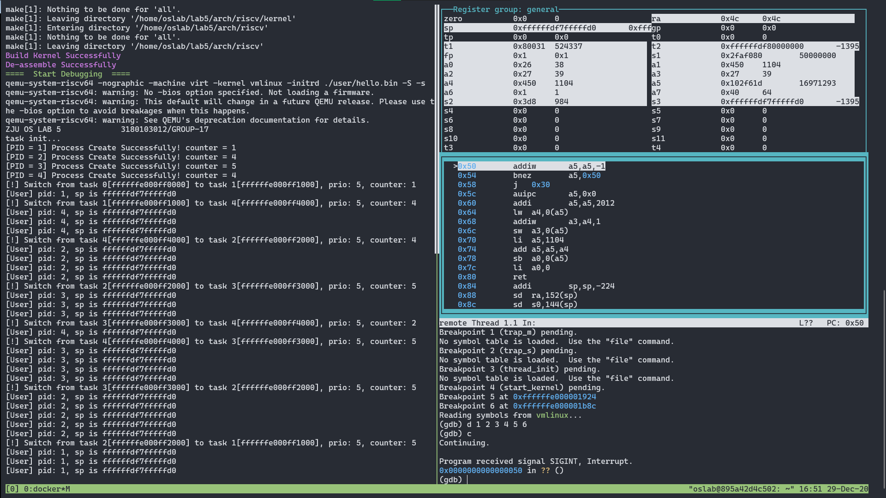
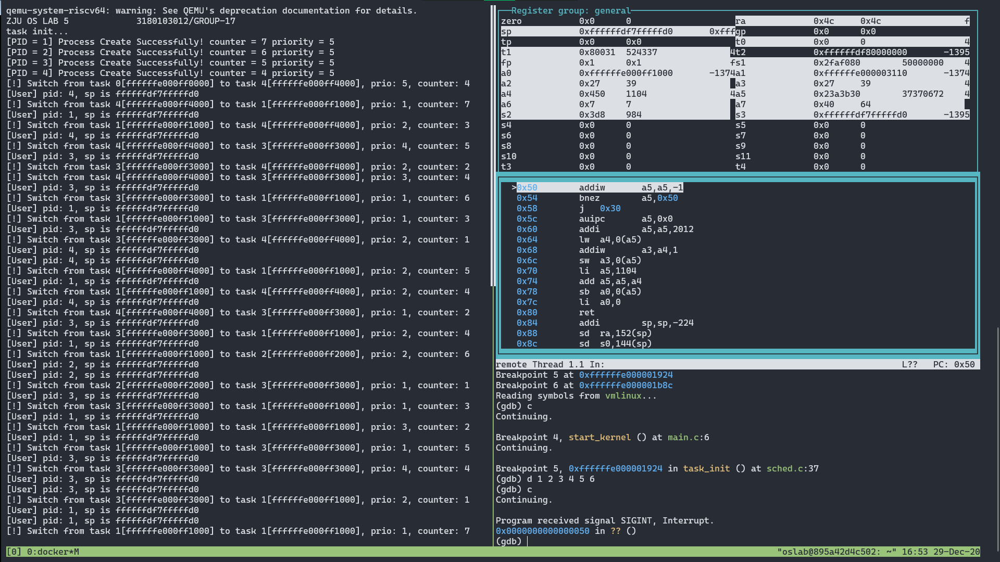
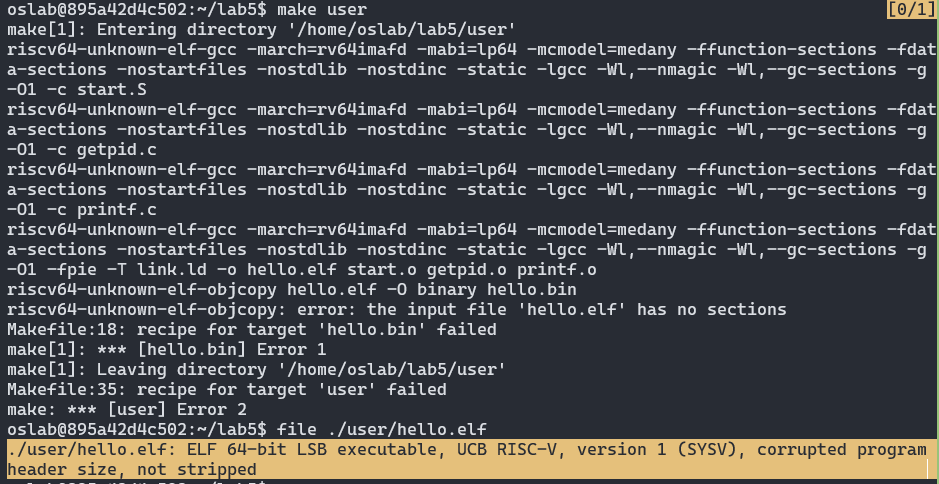

<center><font size=7>《操作系统》Lab5</font></center><br /><div align='right'><font size=4><b>陈希尧</b> 3180103012</font><br /><div align='right'><font size=4>Group17</font></div>

[TOC]

# Lab Basis

## Purpose

结合课堂学习的页式内存管理以及虚拟内存的相关知识，尝试在已有的程序上开启 MMU 并实现页映射，保证之前的进程调度能在虚拟内存下正常运行

## Environment

OS: Ubuntu 18.04.5 LTS on Windows 10 x86_64 (WSL2)

Kernel: 4.19.128-microsoft-standard

Docker version 19.03.13

## Lab Principle

### New Register

#### medeleg

medeleg has a bit position allocated for every synchronous exception shown in Table 3.6 on page 40, with the index of the bit position equal to the value returned in the mcause register (i.e., setting bit 8 allows user-mode environment calls to be delegated to a lower-privilege trap handler).

#### mscratch

The mscratch register is an MXLEN-bit read/write register dedicated for use by machine mode. Typically, it is used to hold a pointer to a machine-mode hart-local context space and swapped with a user register upon entry to an M-mode trap handler.

### New Instructions

* csrrw rd, csr, zimm[4:0]
    * t = CSRs[csr]; CSRs[csr] = x[rs1]; x[rd] = t
    * 读后写控制状态寄存器 (Control and Status Register Read and Write). I-type, RV32I and RV64I. 记控制状态寄存器 csr 中的值为 t。把寄存器 x[rs1]的值写入 csr，再把 t 写入 x[rd]。
* auipc rd, immediate
    * x[rd] = pc + sext(immediate[31:12] << 12)
    * PC 加立即数 (Add Upper Immediate to PC). U-type, RV32I and RV64I.
    * 把符号位扩展的 20 位（左移 12 位）立即数加到 pc 上，结果写入 x[rd]。
* sfence.vma rs1, rs2
    * Fence(Store, AddressTranslation)
    * 虚拟内存屏障(Fence Virtual Memory). R-type, RV32I and RV64I 特权指令。
    * 根据后续的虚拟地址翻译对之前的页表存入进行排序。当 rs2=0 时，所有地址空间的翻译都 会受到影响；否则，仅对 x[rs2]标识的地址空间的翻译进行排序。当 rs1=0 时，对所选地址 空间中的所有虚拟地址的翻译进行排序；否则，仅对其中包含虚拟地址 x[rs1]的页面地址翻 译进行排序。
* addiw rd, rs1, immediate
    * x[rd] = sext((x[rs1] + sext(immediate))[31:0])
    * 加立即数字(Add Word Immediate). I-type, RV64I.
    * 把符号位扩展的立即数加到 x[rs1]，将结果截断为 32 位，把符号位扩展的结果写入 x[rd]。
        忽略算术溢出。


# Lab Steps

## Lab Env

```zsh
$ docker run --name lab5 -it -v /mnt/c/Users/Ulysses/OneDrive/Jun_A/OS/Lab/Lab5/lab5_3180103012:/home/oslab/lab5 -u oslab -w /home/oslab/lab5 oslab:2020 /bin/bash
$ docker start lab5
$ docker exec -it -u oslab -w /home/oslab/lab5 lab5 bash
oslab@895a42d4c502:~/lab5$ ln -s ~/lab5/.gdbinit ~/.gdbinit
oslab@895a42d4c502:~/lab5$ sed -i '$aalias md=make\\ \\&\\&\\ make\\ debug' ~/.bashrc
oslab@895a42d4c502:~/lab5$ sed -i '$aalias gdb=/opt/riscv/bin/riscv64-unknown-linux-gnu-gdb' ~/.bashrc
oslab@895a42d4c502:~/lab5$ sed -i '$aalias gv=/opt/riscv/bin/riscv64-unknown-linux-gnu-gdb\\ vmlinux' ~/.bashrc
```

## Manual

[oslab20fall - Wiki - Gitee.com](https://gitee.com/zjuicsr/lab20fall-stu/wikis/lab5)

## Implementation

### 系统调用实现

实验要求的handler_s应该是能处理全部中断的，但是这样太麻烦了，得把原来结构都改掉，因此我将handler_s作为了系统调用的处理函数。

在trap_s里加入对ecall from U的判断：

```assembly
    trap_s_except:

        la s1, scause_e_ecallU
        beq s0, s1, trap_s_ecallU
        ......

        trap_s_ecallU:
            addi sp, sp, -256
            sd x0, 0(sp)
            sd x1, 8(sp)
            sd x2, 16(sp)
            ......
            sd x30, 240(sp)
            sd x31, 248(sp)

            csrr a0, scause  // a0 and a1 will be overwritten here
            csrr a1, sepc
            mv a2, sp
            call handler_s  // a0, a1 in stack have been overwrite
            ld a0, 80(sp)
            ld a1, 88(sp)   // Other regs will be loaded later
            addi sp, sp, 256
            j trap_s_except_end
```

注意，此处将通用寄存器全部压栈，方便系统调用中使用（其实只压a0\~a7也没问题），然后将a0, a1, a2分别赋值，作为`void handler_s(uint64 scause, uint64 sepc, uint64 *regs)`的参数

然后用c实现对系统调用的处理：

```c
extern struct task_struct *current;

size_t handler_sys_write(unsigned int fd, const char *buf, size_t count) {
    size_t cnt = 0;
    if (fd == 1)
        for (cnt = 0; buf[cnt] != 0 && cnt < count; cnt++)
            *UART_VIR_ADDR = (unsigned char)buf[cnt];
    return cnt;
}

long handler_sys_getpid(void) {
    return current->pid;
}

void handler_s(uint64 scause, uint64 sepc, uint64 *regs) {
    uint64 syscall_id    = regs[17];   // a7
    uint64 *syscall_argv = &regs[10];  // a0 ~ a6
    uint64 *syscall_ret  = &regs[10];  // a0 ~ a1

    switch (syscall_id) {
        case SYS_WRITE_ID:
            syscall_ret[0] = handler_sys_write((unsigned int)syscall_argv[0],
                (char *)syscall_argv[1], (size_t)syscall_argv[2]);
            break;
        case SYS_GETPID_ID: syscall_ret[0] = handler_sys_getpid(); break;
        default: break;
    }
}
```

具体实现没啥好说的，只需要注意，此处的返回值a0, a1是写进栈里的，而不是写进寄存器里的，因此在汇编中要将其提取出来，作为实际的存储于寄存器中的返回值。

另外，由于a0, a1是返回值，因此trap_s的context load过程不能将他们两个冲掉（问过周老师了，他说没问题）

### 用户态线程初始化

修改后的线程初始化函数：

```c
/**
 * @brief init tasks, create 4 threads running dead-loop
 */
void task_init(void) {
    current = (struct task_struct *)TASK_BASE;
    for (int i = 0; i <= LAB_TEST_NUM; i++) {
        task[i]           = (struct task_struct *)(long)(TASK_BASE + TASK_SIZE * i);
        task[i]->state    = TASK_RUNNING;
        task[i]->counter  = i == 0 ? 0 : (PREEMPT_ENABLE ? 8 - i : rand());
        task[i]->priority = 5;
        task[i]->blocked  = 0;
        task[i]->pid      = i;

        task[i]->thread.sp = TASK_BASE + TASK_SIZE * (i + 1);
        asm("la t0, thread_init");
        asm("sd t0, %0" : : "m"(task[i]->thread.ra));

        task[i]->sscratch = (size_t)task[i]->thread.sp;

        task[i]->mm.rtpg_addr    = user_paging_init();
        task[i]->mm.mapping_size = USER_MAPPING_SIZE;

        if (i != 0)
#if PREEMPT_ENABLE == 0  // SJF
            putf("[PID = %d] Process Create Successfully! counter = %d\n", task[i]->pid,
                task[i]->counter);
#else  // PRIORITY
            putf("[PID = %d] Process Create Successfully! counter = %d priority = %d\n",
                task[i]->pid, task[i]->counter, task[i]->priority);
#endif
    }
    asm("ld t0, %0" : : "m"(task[0]->sscratch));
    asm("csrw sscratch, t0");
}
```

新增的步骤如下：

1. 对每个进程的页表进行初始化，具体见[下一节](#用户态页表映射)
2. 将当前线程的S的sp赋给task_struct的sscratch（我没有使用手册中的方法，感觉我这样更简洁也没有逻辑问题）
3. 在最后，将当前进程(task[0])的task_struct中的sscratch写入寄存器sscratch，以便于之后第一次的trap_s能正常进行

然后修改thread_init函数：

```assembly
.global thread_init
thread_init:
    li sp, 0xffffffdf80000000
    li t0, 0x100
    csrc sstatus, t0  # sstatus.SPP=0
    li t0, 0x0
    csrw sepc, t0
    sret
```

设置用户调用所需的sp，然后将sstatus.SPP复位，以便sret之后可以进入U模式，然后设置sepc为用户程序所在地址，然后sret

### 用户态页表映射

这个过程仍然是在S模式下进行，因此仍可以使用上次实验实现的kalloc进行页表的存储空间的分配。

由于用户态模式的系统调用实现是在S模式下进行的，因此仍然需要内核的页表映射，因此每次在进行用户页表的映射初始化时，先将内核模式的根页表赋值到用户态的根页表（只需要根的就行了），然后再在上面进行用户映射的建立（由于没有重复的地址空间，因此是可行的）

至于分配本身，倒没什么难度，对于用户程序和用户栈，各给1MB的空间（其实一个Page绰绰有余，但是反正空间也用不完），然后权限分别是XWR和WR（助教说程序不用分段了，整挺好），记得还要把U的bit给打开。

用户栈的分配要注意：各进程的VA相同但是PA是不同的。

实现如下：

```c
uint64 *user_paging_init(void) {
    static uint64 *kernel_rtpg_addr       = NULL;
    static uint64 user_stack_top_physical = USER_PHY_ENTRY;

    uint64 *rtpg_addr = (uint64 *)kalloc(PAGE_SIZE);

    // Init kernel_rtpg_addr
    if (!kernel_rtpg_addr) {
        asm("la t0, kernel_rt_pg_addr");
        asm("sd t0, %0" : : "m"(kernel_rtpg_addr));
    }

    // Copy Kernel Page
    memcpy_byte(rtpg_addr, kernel_rtpg_addr, PAGE_SIZE);

    // Map user program
    create_mapping(
        rtpg_addr, 0, USER_PHY_ENTRY, USER_MAPPING_SIZE, PROT_U | PERM_R | PERM_W | PERM_X);

    // Map user stack
    create_mapping(rtpg_addr, USER_STACK_TOP - USER_MAPPING_SIZE,
        (user_stack_top_physical += USER_MAPPING_SIZE), USER_MAPPING_SIZE,
        PROT_U | PERM_R | PERM_W);

    return rtpg_addr;
}
```

### 用户态线程切换

在原有基础上实现如下功能：

1. 切换前保存sscratch进入task_struct
2. 切换后加载task_struct的sscratch（内容是user的sp）
3. 重新写satp，更改为当前进程的根页表

```c
/**
 * @brief context switch from current to next
 *
 * @param next
 */
void switch_to(struct task_struct *next) {
    if (current == next)
        return;

    asm("addi sp, sp, 32");  // Restore the stack of switch_to
    CONTEXT_SAVE(current);   // Do context save

    asm("csrr t0, sscratch");
    asm("sd t0, %0" : : "m"(current->sscratch));

    current = next;  // `next` in $s0(-O0), will be overwrite soon

    asm("ld t0, %0" : : "m"(current->sscratch));
    asm("csrw sscratch, t0");

    asm("ori t0, zero, 8");
    asm("sll t0, t0, 16");
    asm("ori t0, t0, 0");
    asm("sll t0, t0, 44");
    asm("ld t1, %0" : : "m"(current->mm.rtpg_addr));
    asm("srl t1, t1, 12");
    asm("or t0, t0, t1");
    asm("csrw satp, t0");
    asm("sfence.vma");

    CONTEXT_LOAD(current);  // This `current` is the argv `next`

    asm("ret");
}
```


# Lab Results

**文件结构**

```
.
├── Makefile
├── arch
│   └── riscv
│       ├── Makefile
│       ├── boot
│       ├── include
│       │   ├── sched.h
│       │   ├── syscall.h
│       │   ├── types.h
│       │   └── vm.h
│       └── kernel
│           ├── Makefile
│           ├── entry.S
│           ├── head.S
│           ├── sched.c
│           ├── strap.c
│           ├── vm.c
│           └── vmlinux.lds
├── include
│   ├── put.h
│   ├── rand.h
│   └── test.h
├── init
│   ├── Makefile
│   ├── main.c
│   └── test.c
├── lib
│   ├── Makefile
│   ├── put.c
│   └── rand.c
├── misc
│   ├── dasm.S
│   ├── hello_dasm.S
│   ├── hello_section.txt
│   ├── help.py
│   ├── help.cpp
│   ├── syscall.c
│   └── vmlinux_section.txt
├── report
│   └── 3180103012.pdf
└── user
    ├── Makefile
    ├── getpid.c
    ├── link.ld
    ├── printf.c
    ├── start.S
    ├── stddef.h
    ├── stdio.h
    ├── syscall.h
    └── types.h
```

**运行结果**

\* 用户程序循环次数为50000000，计时器中断间隔为1000000

**SJF**



**PRIORITY**




# Problems & Thoughts

## Debug Logs

### 内核部分

1. 开始测试syscall有没有写对时，是直接在schedule中用syscall，发现无法调用。后来发现此时尚在s模式，用ecall需要设置ecall from S的代理
   
    * 然而这会导致STimer处理中的ecallS也被托管，所以debug完调用的正确性就得把它关掉
2. 不能在trap_s里直接写syscall的处理，不然context load一下就把返回值给搞没了
3. 后来加了些东西，导致代码段长度超过0x2000，一直报inst read的page fault，找了挺久发现是进行段保护的时候将text段长度当作0x2000，0x2000之后的代码段就没有X权限了，改成0x3000即可
4. thread_init里面不能`li t0, 0x84000000`，而是要`li t0, 0x0`
5. 0x0也不行，里面的指令是0x0040006f，得`li t0, 0x4 `
6. 除了以上两点，==thread_init还要注意要把ssatus.SPP复位，否则sret之后还是S模式==
7. 出现了可以gdb打印指令但是报inst PF的错，发现是忘记将User空间映射时PTE的U打开了
   
    * 仅可以打开leaf PTE的，nonleaf的不能开
8. 没有进行user和supervisor的sp切换（我实在看不懂手册写的是啥玩意），导致trap_s的第一条context switch就开始page fault然后再进入trap_s再报错的死递归
9. 发现用户态的sp会跑到0xffffffdf800003a8去
   
    * trap_s一直都是scause=13，但是每两次trap_s之后，sp会+=0x10
10. sepc=0x30，说明是用户态进入的trap_S，但是sstatus.spp是1，这就不对劲了（因为S模式无法读U的page，因此导致了scause=12的instPF）
    * 开了sstatus.SUM也没用
        * The U bit indicates whether the page is accessible to user mode. U-mode software may only access the page when U=1. If the SUM bit in the sstatus register is set, supervisor mode software may also access pages with U=1. However, supervisor code normally operates with the SUM bit clear, in which case, supervisor code will fault on accesses to user-mode pages. Irrespective of SUM, the supervisor may not execute code on pages with U=1.
        * The SUM (permit Supervisor User Memory access) bit modifies the privilege with which S-mode loads and stores access virtual memory. When SUM=0, S-mode memory accesses to pages that are accessible by U-mode (U=1 in Figure 4.17) will fault. When SUM=1, these accesses are permitted. SUM has no effect when page-based virtual memory is not in effect, nor when executing in U-mode. <u>Note that S-mode can never execute instructions from user pages, regardless of the state of SUM.</u>
11. 以上三个问题均由于修改了struct task_struct导致thread的offset不再是40导致，修改后即可
12. 出现了sepc=0xffffffdf7ffffe72, sp=0xffffffe000ff1fff, sscratch=0x10d的情况，说明pc和sscratch被交换过了
13. sp=0xffffffdf7ffffde8出现了store PF(但是此时SPP=1，必然PF，所以得从最早的一次去找错)
14. 接13，第一个非ecallU的trapS（之前还有一次stimer，两次ecallU）是0xffffffe000001e38处的`lbu a5, 0(a5)`出现的loadPF，此时a5=0x450，但是SPP还是1（之前两次ecallU都是0）（因为这是来自sys_write_imp的PF，所以必然是1），而由于0x450这里开了U，所以S下无法读
    * ==问题在于传的字符串是在U的rodata段里的，这里从S模式是无法读的==
    * ==看起来sstatus.sum不能关的样子==
15. 为什么pc会跑到栈上去啊？==因为`time_sep_init`设定得太小了！还没初始化完页表就跑去时钟中断了，改大了即可==
16. 当程序第二次进入同一个线程后，sp会减到S的栈去，这远低于定义的user_stack_top，所以会导致page_fault
     * <div align="left"></div>
     * 原因：从用户态进入trap_s后（S timer），sscratch会用于保存用户栈的sp的值，当switch_to时，这个值又会被冲掉（冲成了下一个线程的内核栈的sp
       
         * 原因：sscratch只做了context load没做context save
    
17. 本来是给多个用户态进程的栈同一个物理空间的，后来发现这样不行，于是就各给了16MB的物理空间，结果不行，一开始没搞懂为什么会这样，后来发现是内存不够用了，改成各给1MB就行了

### 用户态测试程序

#### 编译问题

无法编译user code，会得到一个奇怪的东西



一开始我以为是CF的问题，因为助教没有提供CF，但是当我用自己的CF替代新的commit中的CF时也能正常编译，后来我发现是link.ld的问题：

```
ENTRY(_start)

SECTIONS
{
    . = 0x0;
    _start = .;
    .text.init : { *(.text.init) }
    .text : { *(.text) }
    .data : { *(.data) }
}
```

是不行的，要改成：

```
ENTRY(_start)

SECTIONS
{
    . = 0x0;
    _start = .;
    .text.init : { KEEP(*(.text.init)) }
    .text : { KEEP(*(.text)) }
    .data : { KEEP(*(.data)) }
}
```

根据查阅的[资料](https://stackoverflow.com/questions/9827157/what-does-keep-mean-in-a-linker-script/)，"Usually used for sections that have some special meaning in the binary startup process, more or less to mark the roots of the dependency tree."，这就类似于gdb中的"set breakpoint pending on"，没有开的话在编译obj时符号本obj里没用到的函数就直接丢失了，自然没法正常编译。

#### 汇编中迭代次数的问题

在实验中我发现用户态程序的两次输出之间会隔很久（约10s）

main的c语言实现：

```c
int main() {
    while (1) {
        printf("[User] pid: %ld, sp is %lx\n", getpid(), current_sp);
        for (unsigned int i = 0; i < 0xFFFFFFFF; i++)
            ;
    }
    return 0;
}
```

可见它会在输出当前的pid和sp后通过循环0xFFFFFFFF次起到一个类似于sleep的作用，使得输出是肉眼可见的

反汇编hello.bin的部分结果：

```assembly
0000000000000004 <main>:
   4:	fd010113          	addi	sp,sp,-48
   8:	02113423          	sd	ra,40(sp)
   c:	02813023          	sd	s0,32(sp)
  10:	00913c23          	sd	s1,24(sp)
  14:	01213823          	sd	s2,16(sp)
  18:	01313423          	sd	s3,8(sp)
  1c:	00010993          	mv	s3,sp
  20:	00000917          	auipc	s2,0x0
  24:	3b890913          	addi	s2,s2,952 # 3d8 <printf+0x358>
  28:	fff00493          	li	s1,-1
  2c:	0ac00893          	li	a7,172
  30:	00000073          	ecall
  34:	00050413          	mv	s0,a0
  38:	00098613          	mv	a2,s3
  3c:	00040593          	mv	a1,s0
  40:	00090513          	mv	a0,s2
  44:	03c000ef          	jal	ra,80 <printf>
  48:	00048793          	mv	a5,s1
  4c:	fff7879b          	addiw	a5,a5,-1
  50:	fe079ee3          	bnez	a5,4c <main+0x48>
  54:	fd9ff06f          	j	2c <main+0x28>
```

可见，通过`li s1, -1`会将for循环次数赋值给s1，然后再将其赋给a5，a5将起到i的作用，循环s1次，但在实际中gdb会发现s1的值并不为0xFFFFFFFF


猜想是因为编译时将s1认作了32位寄存器。

尝试自己编译user test program（commit \#786e01c），结果相同。

后来发现使用的是addiw，会进行32位截断，因此实际上ok的。

<!--## Thoughts-->

<!--累了，不写了，就看上面吧。-->


# Appendix

## Reference

[Special sections in Linux binaries - LWN.net](https://lwn.net/Articles/531148/)

[The RISC-V Instruction Set Manual, Volume II: Privileged Architecture | Five EmbedDev](http://www.five-embeddev.com/riscv-isa-manual/latest/supervisor.html#sv32algorithm)

[ld - What does KEEP mean in a linker script? - Stack Overflow](https://stackoverflow.com/questions/9827157/what-does-keep-mean-in-a-linker-script/)

## Code

### Makefile_top

```makefile
export TOP=$(shell pwd)
export RISCV=/opt/riscv
export PATH:=${PATH}:${RISCV}/bin

export
CROSS_=riscv64-unknown-elf-
AR=${CROSS_}ar
CC=${CROSS_}gcc
LD=${CROSS_}ld
OBJCOPY=${CROSS_}objcopy
OBJDUMP=${CROSS_}objdump
READELF=${CROSS_}readelf

ISA ?= rv64imafd
ABI ?= lp64

INCLUDE = -I ${TOP}/include/ -I ${TOP}/arch/riscv/include/
CF = -march=$(ISA) -mabi=$(ABI) -mcmodel=medany -ffunction-sections -fdata-sections -nostartfiles -nostdlib -nostdinc -static -lgcc -Wl,--nmagic -Wl,--gc-sections -g
# CFLAG = ${CF} ${INCLUDE} -D SJF
CFLAG = ${CF} ${INCLUDE} -D PRIORITY

.PHONY: all user kernel dasm run debug clean


all: user kernel dasm


user:
	@make -C ${TOP}/user/
	@echo "\e[35mBuild User Program Successfully\e[0m"


kernel:
	@make -C ${TOP}/lib/
	@make -C ${TOP}/init/
	@make -C ${TOP}/arch/riscv/kernel/
	@make -C ${TOP}/arch/riscv/
	@echo "\e[35mBuild Kernel Successfully\e[0m"


dasm: ${TOP}/misc/dasm.S ${TOP}/misc/vmlinux_section.txt ${TOP}/misc/hello_dasm.S ${TOP}/misc/hello_section.txt
	@echo "\e[35mDisassemble Successfully\e[0m"
${TOP}/misc/dasm.S: ${TOP}/vmlinux
	${OBJDUMP} -S ${TOP}/vmlinux > ${TOP}/misc/dasm.S
${TOP}/misc/vmlinux_section.txt: ${TOP}/vmlinux
	${READELF} -S ${TOP}/vmlinux > ${TOP}/misc/vmlinux_section.txt
${TOP}/misc/hello_dasm.S: ${TOP}/user/hello.elf
	${OBJDUMP} -S ${TOP}/user/hello.elf > ${TOP}/misc/hello_dasm.S
${TOP}/misc/hello_section.txt: ${TOP}/user/hello.elf
	${READELF} -S ${TOP}/user/hello.elf > ${TOP}/misc/hello_section.txt


run: user kernel dasm
	qemu-system-riscv64 -nographic -machine virt -kernel vmlinux -initrd ./user/hello.bin
	@echo "\e[32mRun Successfully\e[0m"


debug: user kernel dasm
	@echo "\e[32mStart Debugging\e[0m"
	qemu-system-riscv64 -nographic -machine virt -kernel vmlinux -initrd ./user/hello.bin -S -s
	@echo "\e[32mEnd Debugging\e[0m"


clean:
	@rm -f ${TOP}/vmlinux ${TOP}/System.map ${TOP}/a.out
	@make -C ${TOP}/arch/riscv/ clean
	@make -C ${TOP}/arch/riscv/kernel/ clean
	@make -C ${TOP}/init/ clean
	@make -C ${TOP}/lib/ clean
	@make -C ${TOP}/user/ clean
	@echo "\e[36mClean Successfully\e[0m"
```

