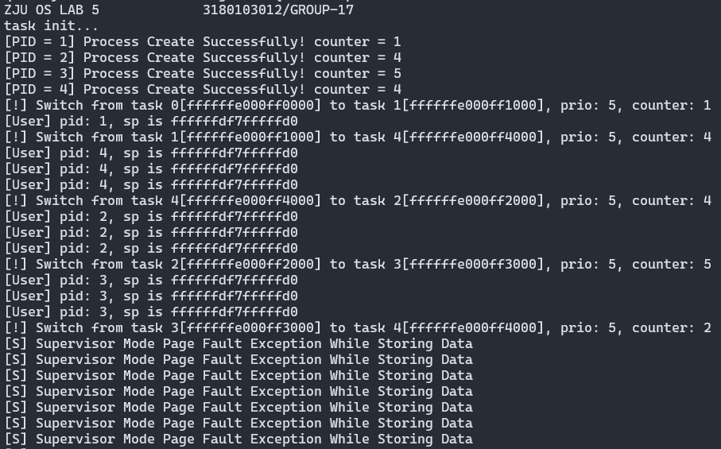
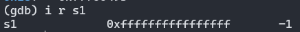

<center><font size=7>《操作系统》Lab5</font></center><br /><div align='right'><font size=4><b>陈希尧</b> 3180103012</font><br /><div align='right'><font size=4>Group17</font></div>

[TOC]

# Lab Basis

## Purpose

结合课堂学习的页式内存管理以及虚拟内存的相关知识，尝试在已有的程序上开启 MMU 并实现页映射，保证之前的进程调度能在虚拟内存下正常运行

## Environment

OS: Ubuntu 18.04.5 LTS on Windows 10 x86_64 (WSL2)

Kernel: 4.19.128-microsoft-standard

Docker version 19.03.13

## Lab Principle

### New Register

#### medeleg

medeleg has a bit position allocated for every synchronous exception shown in Table 3.6 on page 40, with the index of the bit position equal to the value returned in the mcause register (i.e., setting bit 8 allows user-mode environment calls to be delegated to a lower-privilege trap handler).

#### mscratch

The mscratch register is an MXLEN-bit read/write register dedicated for use by machine mode. Typically, it is used to hold a pointer to a machine-mode hart-local context space and swapped with a user register upon entry to an M-mode trap handler.

### New Instructions

* csrrw rd, csr, zimm[4:0]
    * t = CSRs[csr]; CSRs[csr] = x[rs1]; x[rd] = t
    * 读后写控制状态寄存器 (Control and Status Register Read and Write). I-type, RV32I and RV64I. 记控制状态寄存器 csr 中的值为 t。把寄存器 x[rs1]的值写入 csr，再把 t 写入 x[rd]。
* auipc rd, immediate
    * x[rd] = pc + sext(immediate[31:12] << 12)
    * PC 加立即数 (Add Upper Immediate to PC). U-type, RV32I and RV64I.
    * 把符号位扩展的 20 位（左移 12 位）立即数加到 pc 上，结果写入 x[rd]。
* sfence.vma rs1, rs2
    * Fence(Store, AddressTranslation)
    * 虚拟内存屏障(Fence Virtual Memory). R-type, RV32I and RV64I 特权指令。
    * 根据后续的虚拟地址翻译对之前的页表存入进行排序。当 rs2=0 时，所有地址空间的翻译都 会受到影响；否则，仅对 x[rs2]标识的地址空间的翻译进行排序。当 rs1=0 时，对所选地址 空间中的所有虚拟地址的翻译进行排序；否则，仅对其中包含虚拟地址 x[rs1]的页面地址翻 译进行排序。

# Lab Steps

## Lab Env

```zsh
$ docker run --name lab5 -it -v /mnt/c/Users/Ulysses/OneDrive/Jun_A/OS/Lab/Lab5/lab5_3180103012:/home/oslab/lab5 -u oslab -w /home/oslab/lab5 oslab:2020 /bin/bash
$ docker start lab5
$ docker exec -it -u oslab -w /home/oslab/lab5 lab5 bash
oslab@895a42d4c502:~/lab5$ ln -s ~/lab5/.gdbinit ~/.gdbinit
oslab@895a42d4c502:~/lab5$ sed -i '$aalias md=make\\ \\&\\&\\ make\\ debug' ~/.bashrc
oslab@895a42d4c502:~/lab5$ sed -i '$aalias gdb=/opt/riscv/bin/riscv64-unknown-linux-gnu-gdb' ~/.bashrc
oslab@895a42d4c502:~/lab5$ sed -i '$aalias gv=/opt/riscv/bin/riscv64-unknown-linux-gnu-gdb\\ vmlinux' ~/.bashrc
```

## Manual

[oslab20fall - Wiki - Gitee.com](https://gitee.com/zjuicsr/lab20fall-stu/wikis/lab5)

## Implementation

### 系统调用实现

### 用户态线程初始化

### 用户态页表映射

### 用户态线程切换

### 用户态

# Lab Results


# Problems & Thoughts


## Debug Logs

1. 开始测试syscall有没有写对时，是直接在schedule中用syscall，发现无法调用。后来发现此时尚在s模式，用ecall需要设置ecall from S的代理
    * 然而这会导致STimer处理中的ecallS也被托管，所以debug完调用的正确性就得把它关掉
2. 不能在trap_s里直接写syscall的处理，不然context load一下就把返回值给搞没了
3. 后来加了些东西，导致代码段长度超过0x2000，一直报inst read的page fault，找了挺久发现是进行段保护的时候将text段长度当作0x2000，0x2000之后的代码段就没有X权限了，改成0x3000即可
4. thread_init里面不能`li t0, 0x84000000`，而是要`li t0, 0x0`
5. 0x0也不行，里面的指令是0x0040006f，得`li t0, 0x4 `
6. 除了以上两点，==thread_init还要注意要把ssatus.SPP复位，否则sret之后还是S模式==
7. 出现了可以gdb打印指令但是报inst PF的错，发现是忘记将User空间映射时PTE的U打开了
    * 仅可以打开leaf PTE的，nonleaf的不能开
8. 没有进行user和supervisor的sp切换（我实在看不懂手册写的是啥玩意），导致trap_s的第一条context switch就开始page fault然后再进入trap_s再报错的死递归
9. 发现用户态的sp会跑到0xffffffdf800003a8去
    * trap_s一直都是scause=13，但是每两次trap_s之后，sp会+=0x10
10. sepc=0x30，说明是用户态进入的trap_S，但是sstatus.spp是1，这就不对劲了（因为S模式无法读U的page，因此导致了scause=12的instPF）
    * 开了sstatus.SUM也没用
        * The U bit indicates whether the page is accessible to user mode. U-mode software may only access the page when U=1. If the SUM bit in the sstatus register is set, supervisor mode software may also access pages with U=1. However, supervisor code normally operates with the SUM bit clear, in which case, supervisor code will fault on accesses to user-mode pages. Irrespective of SUM, the supervisor may not execute code on pages with U=1.
        * The SUM (permit Supervisor User Memory access) bit modifies the privilege with which S-mode loads and stores access virtual memory. When SUM=0, S-mode memory accesses to pages that are accessible by U-mode (U=1 in Figure 4.17) will fault. When SUM=1, these accesses are permitted. SUM has no effect when page-based virtual memory is not in effect, nor when executing in U-mode. <u>Note that S-mode can never execute instructions from user pages, regardless of the state of SUM.</u>
11. 以上三个问题均由于修改了struct task_struct导致thread的offset不再是40导致，修改后即可
12. 出现了sepc=0xffffffdf7ffffe72, sp=0xffffffe000ff1fff, sscratch=0x10d的情况，说明pc和sscratch被交换过了
13. sp=0xffffffdf7ffffde8出现了store PF(但是此时SPP=1，必然PF，所以得从最早的一次去找错)
14. 接13，第一个非ecallU的trapS（之前还有一次stimer，两次ecallU）是0xffffffe000001e38处的`lbu a5, 0(a5)`出现的loadPF，此时a5=0x450，但是SPP还是1（之前两次ecallU都是0）（因为这是来自sys_write_imp的PF，所以必然是1），而由于0x450这里开了U，所以S下无法读
    * ==问题在于传的字符串是在U的rodata段里的，这里从S模式是无法读的==
    * 看起来sstatus.sum不能关的样子
15. 为什么pc会跑到栈上去啊？==因为`time_sep_init`设定得太小了！还没初始化完页表就跑去时钟中断了，改大了即可==
16. 当程序第二次进入同一个线程后，sp会减到S的栈去，这远低于定义的user_stack_top，所以会导致page_fault
     * 
     * 原因：从用户态进入trap_s后（S timer），sscratch会用于保存用户栈的sp的值，当switch_to时，这个值又会被冲掉（冲成了下一个线程的内核栈的sp
         * 原因：sscratch只做了context load没做context save


最后一次ecallU

````
(gdb) i r scause
scause         0x8      8
(gdb) i r sepc
sepc           0x390    912    // ecall in <printf>
(gdb) i r sscratch
sscratch       0xffffffdf7fffffd0       -139586437168
(gdb) i r sp
sp             0xffffffdf7ffffe60       0xffffffdf7ffffe60
````

第一次出现instPF

```
(gdb) i r scause
scause         0xc      12
(gdb) i r sepc
sepc           0xffffffdf7ffffe66       -139586437530
(gdb) i r sscratch
sscratch       0xffffffdf7fffffd0       -139586437168
(gdb) i r sp
sp             0xffffffdf7fffff40       0xffffffdf7fffff40
```

第二次出现instPF

```
(gdb) i r scause
scause         0xc      12
(gdb) i r sepc
sepc           0xffffffdf7ffffe6a       -139586437526
(gdb) i r sscratch
sscratch       0xffffffdf7fffffd0       -139586437168
(gdb) i r sp
sp             0xffffffdf7fffff40       0xffffffdf7fffff40
```

### User Compilation的问题

在实验中我发现用户态程序的两次输出之间会隔很久（约10s）

main的c语言实现：

```c

```

可见它会在输出当前的pid和sp后通过循环0xFFFFFFFF次起到一个类似于sleep的作用，使得输出是肉眼可见的

反汇编hello.bin的部分结果：

```assembly
0000000000000004 <main>:
   4:	fd010113          	addi	sp,sp,-48
   8:	02113423          	sd	ra,40(sp)
   c:	02813023          	sd	s0,32(sp)
  10:	00913c23          	sd	s1,24(sp)
  14:	01213823          	sd	s2,16(sp)
  18:	01313423          	sd	s3,8(sp)
  1c:	00010993          	mv	s3,sp
  20:	00000917          	auipc	s2,0x0
  24:	3b890913          	addi	s2,s2,952 # 3d8 <printf+0x358>
  28:	fff00493          	li	s1,-1
  2c:	0ac00893          	li	a7,172
  30:	00000073          	ecall
  34:	00050413          	mv	s0,a0
  38:	00098613          	mv	a2,s3
  3c:	00040593          	mv	a1,s0
  40:	00090513          	mv	a0,s2
  44:	03c000ef          	jal	ra,80 <printf>
  48:	00048793          	mv	a5,s1
  4c:	fff7879b          	addiw	a5,a5,-1
  50:	fe079ee3          	bnez	a5,4c <main+0x48>
  54:	fd9ff06f          	j	2c <main+0x28>
```

可见，通过`li s1, -1`会将for循环次数赋值给s1，然后再将其赋给a5，a5将起到i的作用，循环s1次，但在实际中gdb会发现s1的值并不为0xFFFFFFFF



猜想是因为编译时将s1认作了32位寄存器。

尝试自己编译user test program（commit \#786e01c），

## Thoughts


# Appendix

## Reference

[Special sections in Linux binaries - LWN.net](https://lwn.net/Articles/531148/)

[The RISC-V Instruction Set Manual, Volume II: Privileged Architecture | Five EmbedDev](http://www.five-embeddev.com/riscv-isa-manual/latest/supervisor.html#sv32algorithm)

## Code

### vm.c

```c

```

### vm.h

```c

```

### head.S

```assembly

```

### vmlinux.lds

```

```

