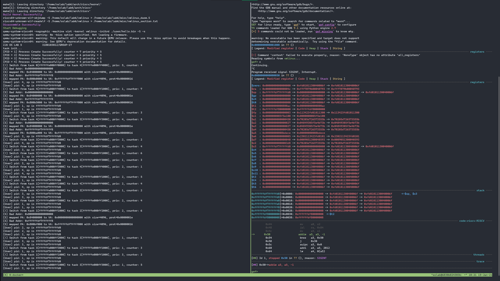

<center><font size=7>《操作系统》Lab6</font></center><br /><div align='right'><font size=4><b>陈希尧</b> 3180103012</font><br /><div align='right'><font size=4>Group17</font></div></div>

[TOC]

==实验完成度：完成了5.1\~5.7，仅剩5.8 fork未完成（感觉工作量有点大，再写期末考就要喜提n挂科了）==

# Lab Basis

## Purpose

* 目标一：了解 **Buddy System** 和 **Slub Allocator** 物理内存管理机制的实现原理，并用 **Buddy System** 配合 **Slub Allocator** 管理和分配物理内存，最终实现统一的内存分配/释放接口:**kmalloc**/**kfree**。
* 目标二：在**mm_struct**中补充实现**vm_area_struct**数据结构的支持，并结合后续**mmap**等系统调用实现对进程**多区域**虚拟内存的管理。
* 目标三：实现**222: mmap, 215: munmap, 226: mprotect**系统调用。
* 目标四：在 **Lab5** 实现用户态程序的基础上，添加缺页异常处理**Page Fault Handler**，并在分配物理页或物理内存区域的同时更新页表。
* 目标五：综合上述实现，为进程加入 **fork** 机制，能够支持创建新的用户态进程，并测试运行。

## Environment

OS: Ubuntu 18.04.5 LTS on Windows 10 x86_64 (WSL2)

Kernel: 4.19.128-microsoft-standard

Docker version 19.03.13

## Lab Principle

### New Register

#### medeleg

medeleg has a bit position allocated for every synchronous exception shown in Table 3.6 on page 40, with the index of the bit position equal to the value returned in the mcause register (i.e., setting bit 8 allows user-mode environment calls to be delegated to a lower-privilege trap handler).

#### mscratch

The mscratch register is an MXLEN-bit read/write register dedicated for use by machine mode. Typically, it is used to hold a pointer to a machine-mode hart-local context space and swapped with a user register upon entry to an M-mode trap handler.

### New Instructions

* csrrw rd, csr, zimm[4:0]
    * t = CSRs[csr]; CSRs[csr] = x[rs1]; x[rd] = t
    * 读后写控制状态寄存器 (Control and Status Register Read and Write). I-type, RV32I and RV64I. 记控制状态寄存器 csr 中的值为 t。把寄存器 x[rs1]的值写入 csr，再把 t 写入 x[rd]。
* auipc rd, immediate
    * x[rd] = pc + sext(immediate[31:12] << 12)
    * PC 加立即数 (Add Upper Immediate to PC). U-type, RV32I and RV64I.
    * 把符号位扩展的 20 位（左移 12 位）立即数加到 pc 上，结果写入 x[rd]。
* sfence.vma rs1, rs2
    * Fence(Store, AddressTranslation)
    * 虚拟内存屏障(Fence Virtual Memory). R-type, RV32I and RV64I 特权指令。
    * 根据后续的虚拟地址翻译对之前的页表存入进行排序。当 rs2=0 时，所有地址空间的翻译都 会受到影响；否则，仅对 x[rs2]标识的地址空间的翻译进行排序。当 rs1=0 时，对所选地址 空间中的所有虚拟地址的翻译进行排序；否则，仅对其中包含虚拟地址 x[rs1]的页面地址翻 译进行排序。
* addiw rd, rs1, immediate
    * x[rd] = sext((x[rs1] + sext(immediate))[31:0])
    * 加立即数字(Add Word Immediate). I-type, RV64I.
    * 把符号位扩展的立即数加到 x[rs1]，将结果截断为 32 位，把符号位扩展的结果写入 x[rd]。
        忽略算术溢出。


# Lab Steps

## Lab Env

### Docker

```zsh
$ docker run --name lab6 -it -v /mnt/c/Users/Ulysses/OneDrive/Jun_A/OS/Lab/Lab6/lab6_3180103012:/home/oslab/lab6 -u oslab -w /home/oslab/lab6 oslab:2020 /bin/bash
$ docker start lab6
$ docker exec -it -u oslab -w /home/oslab/lab6 lab6 bash
oslab@895a42d4c502:~/lab6$ ln -s ~/lab6/.gdbinit ~/.gdbinit
oslab@895a42d4c502:~/lab6$ sed -i '$aalias md=make\\ \\&\\&\\ make\\ debug' ~/.bashrc
oslab@895a42d4c502:~/lab6$ sed -i '$aalias gdb=/opt/riscv/bin/riscv64-unknown-linux-gnu-gdb' ~/.bashrc
oslab@895a42d4c502:~/lab6$ sed -i '$aalias gv=/opt/riscv/bin/riscv64-unknown-linux-gnu-gdb\\ vmlinux' ~/.bashrc
```

### Gdbinit

```
source ~/lab6/misc/gef.py
set breakpoint pending on
set output-radix 16
target remote localhost:1234
```

## Manual

[oslab20fall - Wiki - Gitee.com](https://gitee.com/zjuicsr/lab20fall-stu/wikis/lab6)

## Implementation

### Buddy

首先对buddy的结构体稍加修改，由于提前已知buddy所需的总空间，为了省去分配内存的麻烦，直接设置好bitmap所需的元素个数

```c
struct buddy {
    unsigned long pgnum;                                           // number of `pages`
    unsigned long bitmap[2 * (BUDDY_SPACE_SIZE / PAGE_SIZE) - 1];  // bit map
};
```

然后进行一些宏的编写，根据手册中的结构以及DS课学习的知识，设计出满二叉树遍历时的父子关系映射：

```c
#define BIN_TREE_UPCHILD(__X) ((__X)*2 + 1)
#define BIN_TREE_DOWNCHILD(__X) ((__X)*2 + 2)
#define BIN_TREE_PARENT(__X) (((__X)-1) / 2)
```

设计buddy sys的初始化函数，从根节点开始，以i作为bitmap的访问索引，按层遍历，每一层都赋值为layer_size，隔层layer_size减半，进行bitmapp的初始化。然后将内核的程序那段空间分配出去，以避免创建内核页表时使用了这部分空间。

```c
buddy.pgnum = PAGE_FLOOR(BUDDY_SPACE_SIZE);
int i = 0;
for (uint64 layer_size = buddy.pgnum; layer_size; layer_size /= 2)
    for (uint64 node_count = 0; node_count < buddy.pgnum / layer_size; node_count++)
        buddy.bitmap[i++] = layer_size;

alloc_pages(PAGE_FLOOR(KERNEL_PROG_SIZE));
```

设计alloc_pages函数，以要分配的npages为参数，从根节点开始遍历，依次访问上下子节点，如果他们中有一剩余的页数比npages大，则遍历至那个节点。如果两个都不满足就退出遍历（由于开始有内存剩余空间的检测，因此此时的节点必能满足要求）。

```c
while (1) {
    // alloc_size check make sure BIN_TREE_CHILD will not overflow access
    if (alloc_size > 1 && buddy.bitmap[BIN_TREE_UPCHILD(bm_loc)] >= npages)
        bm_loc = BIN_TREE_UPCHILD(bm_loc);
    else if (alloc_size > 1 && buddy.bitmap[BIN_TREE_DOWNCHILD(bm_loc)] >= npages) {
        bm_loc = BIN_TREE_DOWNCHILD(bm_loc);
        ret_addr_pg += alloc_size / 2;
    } else
        break;
    alloc_size /= 2;
}
```

然后从这个节点开始，向上遍历回根节点，将已分配的空间减去。

```c
for (int i = bm_loc;; i = BIN_TREE_PARENT(i)) {  // sub alloc size from the parent tree
    buddy.bitmap[i] -= alloc_size;
    if (!i)
        break;
}
```

free_pages类似，不过是遍历方向不同。根据释放地址，获得叶节点的索引，然后从下往上遍历，直到遇到那个为0的节点，将size改回去

```c
for (int bm_loc = buddy.pgnum - 1 + PAGE_FLOOR(addr - BUDDY_START_ADDR);;
     bm_loc = BIN_TREE_PARENT(bm_loc)) {
    if (buddy.bitmap[bm_loc] && size_not_found) {
        alloc_size <<= 1;
    } else {  // Found alloc page
        size_not_found = 0;
        buddy.bitmap[bm_loc] += alloc_size;
        if (!bm_loc)  // Stop at root
            return;
    }
}
```

### Kmalloc/Kfree

这两个没啥好说的。

malloc是把slub一个个试过去，可以就用，不行就用buddy

```c
if (size == 0)
    return NULL;
for (objindex = 0; objindex < NR_PARTIAL; objindex++)
    if (size <= kmem_cache_objsize[objindex])
        if (p = kmem_cache_alloc(slub_allocator[objindex]))  // Not NULL
            break;
if (objindex >= NR_PARTIAL) {
    p = alloc_pages(PAGE_CEIL(size));
    set_page_attr(p, PAGE_CEIL(size), PAGE_BUDDY);
}
```

free是根据page的属性调用不同的free函数

```c
page = ADDR_TO_PAGE(addr);
if (page->flags == PAGE_BUDDY) {
    free_pages(addr);
    clear_page_attr(ADDR_TO_PAGE(addr)->header);
} else if (page->flags == PAGE_SLUB) {
    kmem_cache_free(addr);
}
```

### Mmap

首先找建议的地址是否和已存在的vm area发生冲突（vm area list为空也算无冲突），如果冲突了就另外分配一段给定长度的地址作为返回值。

```c
_Bool isCollision = 0;
if (mm->vm_area_list)  // vm_area_list not empty
    for (struct vm_area_struct *p = mm->vm_area_list; p->vm_next; p = p->vm_next)
        if (p->vm_start <= start && start < p->vm_end ||
            p->vm_start < start + length && start + length <= p->vm_end) {
            isCollision = 1;
            break;
        }

if (isCollision)  // Collision
    start = (void *)get_unmapped_area(length);
```

然后新建一个vm area的结构，将属性设置好，遍历vm area list，将其插入链表。

```c
if (!mm->vm_area_list) {  // Empty vm area list
    vm_area_ptr->vm_prev = NULL;
    mm->vm_area_list     = vm_area_ptr;
} else {  // Traverse existing vm area list
    struct vm_area_struct *p;
    for (p = mm->vm_area_list; p->vm_next; p = p->vm_next)
        ;
    p->vm_next           = vm_area_ptr;
    vm_area_ptr->vm_prev = p;
}
```

### Munmap/Mprotect

free_page_tables和mprotect较为类似，都是一次page walk得到pte的地址，然后重写pte

```c
void free_page_tables(uint64 pagetable, uint64 va, uint64 n, int free_frame) {
    for (uint64 addr_last_byte = va + n - 1; va <= addr_last_byte; va += PAGE_SIZE) {
        LoadPTE(page_walk(pagetable, va), 0, 1);
    }
}
int mprotect(void *__addr, size_t __len, int __prot) {
    for (uint64 addr_last_byte = __addr + __len - 1; __addr <= addr_last_byte;
         __addr += PAGE_SIZE) {
        LoadPTE(page_walk(current->mm->rtpg_addr, __addr), __prot, 1);
    }
}
```

munmap遍历vm area list，找到所有`[start, start + length)`中的vm area，将其空间释放，然后将这个vm area的结构从来链表中删除，别忘了要free结构体本身占用的内存。找到返回0，没有返回-1.

```c
int munmap(void *start, size_t length) {
    _Bool found = 0;
    for (struct vm_area_struct *p = current->mm->vm_area_list; p; p = p->vm_next) {
        if (p->vm_start >= start && p->vm_end <= start + length) {
            free_page_tables(current->mm->rtpg_addr, start, PAGE_CEIL(length), 1);
            if (p->vm_prev)
                p->vm_prev->vm_next = p->vm_next;
            if (p->vm_next)
                p->vm_next->vm_prev = p->vm_prev;
            kfree(p);
            found = 1;
        }
    }
    return (found ? 0 : -1);
}
```

### Fault

首先从stval获得bad addr

```c
uint64 bad_addr;
asm("csrr t0, stval");
asm("sd t0, %0" : : "m"(bad_addr));
```

遍历vm area list，看bad addr是否在任一个vm area里面

```c
struct vm_area_struct *vm_area_ptr = current->mm->vm_area_list;
for (; vm_area_ptr; vm_area_ptr = vm_area_ptr->vm_next) {
    if (vm_area_ptr->vm_start <= bad_addr && bad_addr < vm_area_ptr->vm_end)
        break;
}
if (!vm_area_ptr) {  // Not Found
    panic("Invalid vm area in page fault - no vm area found for bad_addr=0x%lx", bad_addr);
    return;
}
```

根据scause，找是否有符合的PF类型（由于scause在异常的情况下最高位为0，因此可以直接用switch）

```c
uint64 scause;
asm("csrr t0, scause");
asm("sd t0, %0" : : "m"(scause));

_Bool prot_match;
int prot = PROT_U;
switch (scause) {
    case CAUSE_FETCH_PAGE_FAULT:
        prot_match = (vm_area_ptr->vm_page_prot.pgprot | PERM_X);
        break;
    case CAUSE_LOAD_PAGE_FAULT:
        prot_match = (vm_area_ptr->vm_page_prot.pgprot | PERM_R);
        break;
    case CAUSE_STORE_PAGE_FAULT:
        prot_match = (vm_area_ptr->vm_page_prot.pgprot | PERM_W);
        break;
    default: prot_match = 0; break;
}
if (!prot_match) {
    panic("Invalid vm area in page fault - prot unmatch.");
    return;
}
```

根据bad addr的权限，分类进行物理地址和权限的控制。注意物理栈要用kmalloc来分配空间而不是直接指定。

```c
uint64 pa;
if (bad_addr < USER_MAPPING_SIZE) {  // User Prog
    pa = USER_PHY_ENTRY + PAGE_FLOOR(bad_addr) * PAGE_SIZE;
    prot |= PERM_R | PERM_W | PERM_X;
} else if (bad_addr >= USER_STACK_TOP - USER_MAPPING_SIZE) {  // User Stack
    pa = (uint64)VA2PA(kmalloc(PAGE_SIZE));
    prot |= PERM_R | PERM_W;
} else  // Other
    pa = (uint64)VA2PA(kmalloc(PAGE_SIZE));
```

最后调用create_mapping进行映射，注意要把LoadPTE的prot部分的mask打开（见[Debug Logs](#Debug Logs)的7）

```c
create_mapping(current->mm->rtpg_addr, PAGE_FLOOR(bad_addr) * PAGE_SIZE, pa,
               PAGE_SIZE, prot);
```

### Scheduling

修改task_init的逻辑。

在对每个进程初始化前，全局部分得先slub_init，然后获得内核根页表地址。

```c
slub_init();

uint64 *k_rtpg;
asm("la t0, kernel_rt_pg_addr");
asm("sd t0, %0" : : "m"(k_rtpg));
```

对于每个线程，将vm_area_list先初始化为NULL，表示当前并没有va area。

```c
task[i]->mm->vm_area_list = NULL;
```

然后进行页表的映射准备：先申请一页空间作为当前进程的根页表，然后将内核根页表的内容复制到用户根页表。对于用户程序，给予RWX权限，对于用户栈，给予RW权限。此时并没有实际映射，而只是准备好vm area，等到发生page fault才进行on-demand映射。

```c
task[i]->mm->rtpg_addr = (uint64 *)VA2PA(kmalloc(PAGE_SIZE));
memcpy(task[i]->mm->rtpg_addr, k_rtpg, PAGE_SIZE);
do_mmap(task[i]->mm, 0, USER_MAPPING_SIZE, VM_READ | VM_WRITE | VM_EXEC,
        MAP_PRIVATE | MAP_ANONYMOUS, 0);
do_mmap(task[i]->mm, USER_STACK_TOP - USER_MAPPING_SIZE, USER_MAPPING_SIZE,
        VM_READ | VM_WRITE, MAP_PRIVATE | MAP_ANONYMOUS, 0);
```

### Handler

针对mmap/munmap/mprotect三个系统调用，用handler处理：

```c
switch (id) {
    // ....
    case MMAP_ID:
        ret[0] = mmap((void *)argv[0], (size_t)argv[1], (int)argv[2], (int)argv[3],
                      (int)argv[4], (__off_t)argv[5]);
        break;
    case MUNMAP_ID: ret[0] = munmap((void *)argv[0], (size_t)argv[1]);
        break;
    case MPROTECT_ID: ret[0] = mprotect((void *)argv[0], (size_t)argv[1], (int)argv[2]);
        break;
    // ....
}
```

针对page fault，在trap_s里就处理：

```assembly
trap_s_instPF:
    call do_page_fault
    j trap_s_except_end

trap_s_loadPF:
    call do_page_fault
    j trap_s_except_end

trap_s_storePF:
    call do_page_fault
    j trap_s_except_end
```


# Lab Results

**文件结构**

```
.
├── Makefile
├── arch
│   └── riscv
│       ├── Makefile
│       ├── boot
│       ├── include
│       │   ├── buddy.h
│       │   ├── list.h
│       │   ├── mm.h
│       │   ├── sched.h
│       │   ├── slub.h
│       │   ├── stddef.h
│       │   ├── string.h
│       │   ├── syscall.h
│       │   ├── types.h
│       │   ├── vm.h
│       │   └── vm_flag.h
│       └── kernel
│           ├── Makefile
│           ├── buddy.c
│           ├── entry.S
│           ├── fault.c
│           ├── head.S
│           ├── mm.c
│           ├── sched.c
│           ├── slub.c
│           ├── strap.c
│           ├── vm.c
│           └── vmlinux.lds
├── driver
│   ├── Makefile
│   ├── device.c
│   ├── ns16550a.c
│   ├── rinux_driver.h
│   └── sifive_test.c
├── include
│   ├── device.h
│   ├── rand.h
│   ├── stdio.h
│   ├── stdlib.h
│   └── string.h
├── init
│   ├── Makefile
│   └── main.c
├── lib
│   ├── Makefile
│   ├── exit.c
│   ├── printf.c
│   ├── rand.c
│   └── string.c
└── user
    ├── Makefile
    ├── getpid.c
    ├── hello_lab5.bin
    ├── link.ld
    ├── printf.c
    ├── start.S
    ├── stddef.h
    ├── stdio.h
    ├── syscall.h
    └── types.h
```

**运行结果**

实现了buddy和slub和mmap之后，通过on-demand paging在page fault时映射用户态程序和代码，以lab5（lab6去掉fork）为用户态程序进行测试，结果如下：



可以看到，用户态程序可以正常运行，并且四个进程的程序都会以RWXU权限从0x0映射一个page到0x84000000，用户栈都会以RWU权限从0xffffffdf7ffff000映射一个page到某地址（四个不相同，说明kamlloc使用成功）


# Problems & Thoughts

## Debug Logs

1. 本来写了一个buddy，想拿去测一下lab5能不能跑，搞了半天一直跑不起来，后来发现kernel_page_init的alloc_pages里面的返回值写的是`return (void *)PA2VA(BUDDY_START_ADDR + ret_addr_pg * PAGE_SIZE);`，而在进行内核和用户态的初始化时==pc都还在物理地址空间==，因此不能打开PA到VA的转化。
2. 由于使用了buddy，且程序size是0x1a000（看_end可知），因此给kernel分配完后再alloc 1个page返回值返回值回到0x20000，这会导致vmlinux.ld中kernel_rt_pg_addr的设定与实际的不符。首先尝试直接`kernel_rt_pg_addr = 0x80020000;`，但是这样会报错"relocation truncated to fit"，最后就改成`kernel_rt_pg_addr = _end; kernel_rt_pg_addr = ALIGN(0x20000);`。<u>因为0x1a000是26个pages，所以会占用32个pages(0x20000 bytes)的buddy节点，因此`ALIGN(0x20000)`可以解决这个问题。</u>
3. user页表初始化的时候不能用kmalloc来初始化。。因为kmalloc里面需要set_page_attr，而里面有一步将S的addr转成M空间的地址，然而这时候映射都还没建立完，这样搞必出事。所以create mapping的时候还是得用alloc_pages。
4. 忘记slub_init。
5. `do_mmap(task[i]->mm, 0, USER_MAPPING_SIZE, VM_READ | VM_WRITE | VM_EXEC, MAP_PRIVATE | MAP_ANONYMOUS, 0);`并不能把用户态0x0映射到0x84000000上去。因此需要修改do_page_fault中的映射逻辑，对栈和程序分类讨论。
6. 同3的道理，slub_init不能在未映射时进行。
7. 如果是每次pf添加权限的话，之前对pte的修改逻辑就得改变，之前是”用新的prot取代旧的“，现在得改成“在旧的prot基础上加上新的prot”。<u>这里通过将pte的mask从0xffc0000000000000改为0xffc00000000003fe即可实现。</u>
8. 但是实际问题是thread_init根本就进不了用户态，thread切来切去，用户态没有输出，但也完全没有pf的异常产生。
9. 上述的错因：do_page_fault中关于bad_addr是否在vm area中的判断是`vm_area_ptr->vm_start <= bad_addr && bad_addr < vm_area_ptr->vm_end`而不是`vm_area_ptr->vm_start < bad_addr && bad_addr < vm_area_ptr->vm_end`。
    * 同样，mmap中冲突的判断条件是`p->vm_start <= start && start < p->vm_end || p->vm_start < start + length && start + length <= p->vm_end`而不是`p->vm_start < start && start < p->vm_end || p->vm_start < start + length && start + length < p->vm_end`（注意leqslant的位置）
10. ==还有个老问题，代码变多了text size从0x4000变成了0x5000。==
11. 给用户栈map的时候不能用kmalloc来的作为物理地址，得另外找。
12. 地址floor或ceil的话调用完PAGE_X要记得乘以PAGE_SIZE还原回去。
13. 出现了bad_addr=0xffffffe000000138（thread_init），scause=instPF，spp=0(U)的page fault，说明从U直接跳去S空间了。
14. 把hello.bin改成lab5的就好了。妈的有这事揍他狗日的.jpg。
    * ==然而本质原因是优化参数从O0变成了O1改变了函数调用方式，O0是普通的函数调用，O1是内联函数，不存在`call`对ra的修改，这样再去ret的时候用的就是旧的ra（即S模式下task_init时弄进去的thread_init的地址）==
15. 同7类似，munmap和mprotect时的prot改成overwrite的，PPN保持不变，因此要把mask改成0xfffffffffffffc00。
16. 一个神奇的问题不知道为什么：断点在0x0停不住，在0x4（这是getpid的地址，反正只要是不是0x0的地方都可以）就可以了。

<!--## Thoughts-->

<!--难顶，一学期lab终于结束了。-->


# Appendix

## Reference

[Special sections in Linux binaries - LWN.net](https://lwn.net/Articles/531148/)

[The RISC-V Instruction Set Manual, Volume II: Privileged Architecture | Five EmbedDev](http://www.five-embeddev.com/riscv-isa-manual/latest/supervisor.html#sv32algorithm)

[ld - What does KEEP mean in a linker script? - Stack Overflow](https://stackoverflow.com/questions/9827157/what-does-keep-mean-in-a-linker-script/)